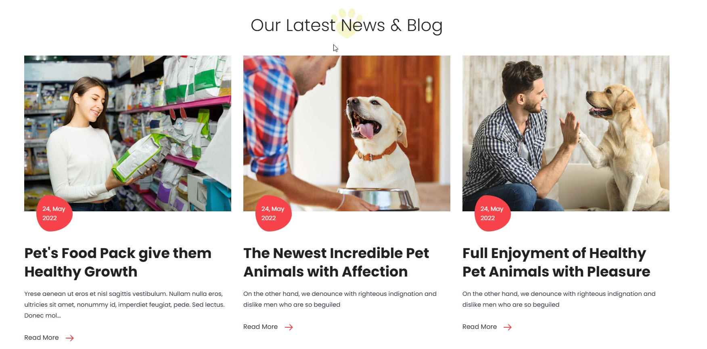

# Blog

### **Blog Settings in Shopify**

A blog on Shopify is a built-in feature that allows store owners to create and manage blog posts directly within their online store. It helps businesses engage with customers, improve SEO, and drive more traffic to their products. The blog should be created from the backend to assign in the customizer.

<figure><figcaption></figcaption></figure>

### **Layout & Display Settings**

<figure><figcaption></figcaption></figure>

* **Show Full Width** – Expands the blog section across the entire screen width.
* **Enable Right & Left Spacing (Works only on Fullwidth)** – Adds spacing to the full-width layout (applies only in full-width mode).
* **Padding (Top, Bottom):** Adjust the inner spacing above and below the section. Top(px), Bottom(px).
* **Margin (Top, Bottom):** Adjust the outer spacing above and below the section. Top(px), Bottom(px).
* **Enable Background Image:** Allows adding a background image for the section.
* **Background Image:** Upload the image (Recommended size based on design requirements).
* **Background Style:** Choose background style **( Fixed, Parallax, or None )**.
* **Background Size:** Choose background size **( Auto, Cover, Contain, Repeat)**.
* **Enable Background Color:** Enable a background color (also used as an overlay color).
* **Overlay Transparency:** Adjust the transparency of the overlay (value between 0.01 and 1).
* **Main Heading:** Customize the Main heading.
* **Sub Heading:** Add a short text to the content.
* **Description:** Add text to share information about the collection.
* **Link Text:** Customize the text for the clickable link.
* **Link URL:** Paste a URL or search for an internal link.

### **Section Color settings**

* **Heading Color:** Customize the heading color (Set Your Preferred Color).
* **Sub Heading Color:** Customize the sub-heading color (Set Your Preferred Color).
* **Description Color:** Customize the description text color (Set Your Preferred Color).
* **Button Background Color:** Customize the button background color (Set Your Preferred Color).
* **Button Text Color:** Customize the button text color (Set Your Preferred Color).
* **Button Hover Background Color:** Customize the hover background color for buttons (Set Your Preferred Color).
* **Button Hover Text Color:** Customize the hover text color for buttons (Set Your Preferred Color).
* **Heading position** : Choose heading positio&#x6E;**( Left, Right, Center )**.

### Blog Settings

* **Select blog:** Choose the blog post.
* **Enable Author Name:** Displays the name of the person who wrote the blog post.
* **Enable Date:** Displays the publication date of the blog post.
* **Enable Comments:** Displays the number of comments or allows visitors to leave comments.
* **Enable Tags:** Tags added to a blog will be used for filtering and viewing relevant posts.
* **Enable Blog Button:** Enable or disable displaying the blog button within the blog layout.
* **Enable Blog Description:** Choose whether to show a short summary of each blog post.
* **Enable Font Awesome Icons For Meta Elements:** Enable or disable displaying the font awesome icon within the blog layout.
* **Recent Articles:** Add recently viewed articles to the blog layout.
* **Banner Style (Not for Masonry Grid):** Choose the banner style **(Grid, List, Overlay).**
* **Total Number of Posts:** Choose the number of post per row.
* **Item Per Row:** Limit the number of displayed blog posts using a range selector.
* **Blog Text Alignment:** Choose the blog alignment **(Center, Left, Right)**.
* **Enable Box Shadow:** Adds a shadow effect to the collection.


Comment should be enabled in the back-end **Dashboard > Blog post > Manage Blogs (top of the blog post dashboard panel) > Add Blog > Allowed**


### Settings for List Style Banners

* **Vertical Position:** Choose the Vertical position **(Top, Center, Bottom).**
* **Content Width - Desktop:** Defines how content and image are split (Eg., 50 / 50 ).
* **Content Width - Laptop (Small Screen):** Defines the layout for smaller screens.(Eg., 35 / 65 ).

### **Settings for Overlay Style Banners**

* **Minimum Height:** Adjust the height.

### **Image Overlay Settings**

* **Image Hover Style:** Choose the image overlay style **(Normal Overlay, Gradient Overlay).**
* **Overlay Color:** Customize the Overlay Color (Set Your Preferred Color).
* **Overlay Opacity:** Adjust the transparency of the overlay (value between 0.01 and 1).
* **Gradient Position (0 to 360) - Only for Gradient Overlay:** Customizer the gradient position.

### Masonry Blog Settings

* **Enable masonry grid (Carousel Option will not work if this is enabled):**&#x20;
* **Main Banner Style:** Choose the main banner style (Grid, Overlay, List).
* **Additional Banners Layout Style:** Choose the main banner style (Grid, Overlay, List).
* **Enable Masonry Reverse:** Enable or disable displaying masonry reverse.

### Blog Color Settings

* **Blog Bg Color:** Customize the Blog background Color (Set Your Preferred Color).
* **Link Color:**  Customize the Link Color (Set Your Preferred Color).
* **Link Hover Color:** Customize the Link Hover Color (Set Your Preferred Color).
* **Text Color:** Customize the Text  Color (Set Your Preferred Color).
* **Icon Color:** Customize the Icon Color (Set Your Preferred Color).
* **Button Bg Color:** Customize the Button Background Color (Set Your Preferred Color).
* **Button Text Color:** Customize the Button Text Color (Set Your Preferred Color).
* **Button Hover Bg Color:**  Customize the Button Hover Background Color (Set Your Preferred Color).
* **Button Hover Text Color:** Customize the Button Hover Text Color (Set Your Preferred Color).
* **Link Color (Overlay Style):** Customize the Link Color (Set Your Preferred Color).
* **Link Hover Color (Overlay Style):** Customize the Link Hover Color (Set Your Preferred Color).
* **Text Color (Overlay Style Only):** Customize the Text Color (Set Your Preferred Color).
* **Icon Color (Overlay Style Only):** Customize the Icon Color (Set Your Preferred Color).
* **Button BG Color (Overlay Style Only):** Customize the Button Background Color (Set Your Preferred Color).
* **Button Text Color (Overlay Style Only):** Customize the Button Text Color (Set Your Preferred Color).
* **Button Hover BG Color (Overlay Style Only):** Customize the Button Hover Background Color (Set Your Preferred Color).
* **Button Hover Text Color (Overlay Style Only):** Customize the Button Hover Text Color (Set Your Preferred Color).

### Carousel Settings

* **Enable Carousel:** Activate the sliding effect for product display.
* **Enable auto height:** Adjust height dynamically based on content.
* **Slide per row (Set 1 for List Style):** Choose the number of slides per row.
* **Column Gap (unit's not needed):** Customizer spacing between columns.
* **Autoplay timing:** Customize the rotation timing (_Use 0 to stop auto-rotate_).
* **Navigation Arrows position:** Choose navigation arrow position **(Top left, Top center, Top bottom, Center, Bottom left, Bottom center, Bottom right).**
* **Center navigation alignment (Select 'Center', in the above dropdown):** Choose navigation alignmen&#x74;**(Top left, Top center, Top bottom, Center, Bottom left, Bottom center, Bottom right).**
* **Navigation Button Bg Color:** Customize the button background color (Set Your Preferred Color).
* **Navigation Button Icon Color:** Customize the button icon color (Set Your Preferred Color).
* **Navigation Button Hover Bg Color:** Customize the hover background color (Set Your Preferred Color).
* **Navigation Button Hover Icon Color:** Customize the hover icon color (Set Your Preferred Color).
* **Navigation Dot Color:** Customize the color of navigation dots (Set Your Preferred Color).
* **Navigation Dot Active Color:** Customize the active navigation dot color (Set Your Preferred Color).

