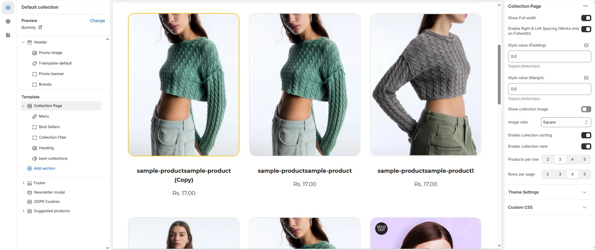
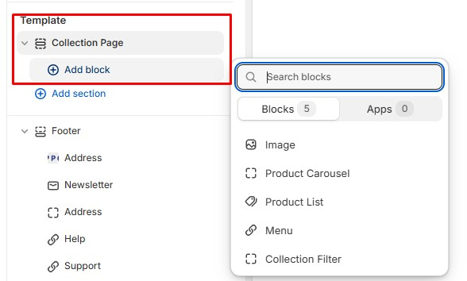

# Default Collection

Collections in Shopify allow you to group products into categories or themes, making it easier for customers to browse your store and find related items.

<figure><figcaption></figcaption></figure>

* **Show Full Width :** Expands the featured collection section across the entire screen width.
* **Enable Right & Left Spacing (Works only on Fullwidth):** Adds spacing on both sides (works only in Full Width mode).
* **Padding (Top, Bottom) :** Adjust the inner spacing above and below the section. Top(px), Bottom(px).
* **Margin (Top, Bottom) :** Adjust the outer spacing above and below the section. Top(px), Bottom(px).
* **Show Collection Image :** Enable or disable the Collection image.
* **Image ratio:** Choose the Image ratio **(Adapt to image, Portrait or Square).**
  * **Adapt to image :** Adjusting the aspect ratio based on the image’s content to ensure it looks visually balanced and well-framed.
  * **Portrait :** A taller image with an aspect ratio like **4:5, 3:4, or 9:16.**
  * **Square :** An image with a **1:1** ratio, meaning the width and height are equal.
* **Enable Collection Sorting :** Enable or disable the collection sorting.
* **Enable Collection View :** Enable or disable the collection view in custom grid.
* **Product Per Row :** Choose the number of items displayed per row .
* **Row Per Page :** Choose the number of items displayed row per page .


Add a block for sidebar purposes.


<figure><figcaption></figcaption></figure>

### **How to Add this Sidebar Content**

### **Menu**

* **Title :**  Customize the menu title.
* **Menu :** Select the menu.

### **Collection Filter**

No customizable settings available  (use the [filter](broken-reference) - search and discovery).

### Product Carousel 

* **Heading:** Customize a title for the product carousel section.
* **Collection:** Select collection.
* **Limit:** Limit the number of products shown in the product carousel.

### **Image**

* **Title :** Customize a title for the Image.
* **Image :** Upload the image (Recommended size based on design requirements).
* **Link Text :** Customize the text for the clickable link.
* **Link :** Paste a URL or search for an internal link.

### **Product List** 

* **Title :** Customize a title for the product list section.
* **Collection:** Select collection.
* **Limit:** Limit the number of products shown in the product list.

