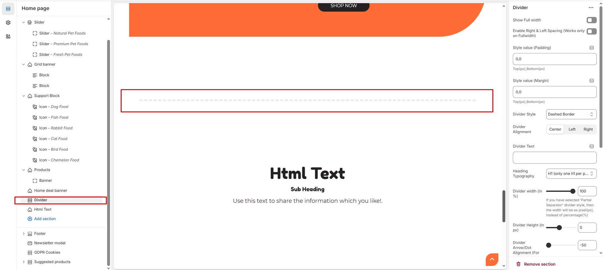

# Divider

The divider allows you to separate sections.


* Navigate to **Shopify Admin > Online Store > Themes**.
* **Click** Customize on your active theme.
* **In the Theme Editor**, click **Add Section > divider**


<figure><figcaption></figcaption></figure>

* **Show Full Width:** Expands the section across the entire screen width.
* **Enable Right & Left Spacing (Works only on Fullwidth):** Adds spacing on both sides (Works only in Full Width mode).
* **Style Value (Padding ) :** Adjust the inner spacing above and below the section. Top(px), Bottom(px).
* **Style Value  (Margin ) :** Adjust the outer spacing above and below the section. Top(px), Bottom(px).
* **Divider style :** Choose the divider style **(Default, Dotted border, Dashed border, Double border, Shadow, Gradient, Bottom arrow, Center dot, Running lines, Partial separators).**
* **Divider Alignment :** Choose the divider alignment **(Left, Center, Right).**
* **Divider Text :** Customize the divider text.
* **Heading Typography :** Customize the heading typography (h1 to h6).
* **Divider Width (in %) :** Customize the divider width (If you have selected 'Partial Separator' divider style, then the width will be as pixel(px), instead of percentage(%).
* **Divider Height (in px) :**  Customize the divide height.
* **Divider Arrow/Dot Alignment (For 'Bottom Arrow' & 'Center Dot' Styles) :**  Customize the range (-50 to 0 ) works only for the style bottom arrow or center dot.
* **Divider Bottom Alignment (Not for 'Partial Separator' Style) :** Customize the range (-50 to 0 ).

### **Section Color settings**

* **Heading color (Only for With Text Divider Style) :** Customize the heading color (Set Your Preferred Color).
* **Divider Color :**  Customize the divider color (Set Your Preferred Color).

#### **Additional Settings** 

* [**Custom Class:**](https://wdtsupport.gitbook.io/shopify-os/custom-class) The Shopify allows you to apply unique CSS styles to specific sections, blocks, or elements within your theme.
