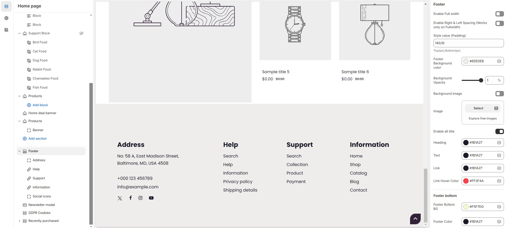

# Footer

A footer on a website provides essential information like contact details, navigation links, and legal disclaimers. It also often includes social media links, copyright notices, and call-to-action buttons.


* **Go to** Shopify Admin > **Online Store > Themes**.
* Click **Customize** on your active theme.
* Navigate to **Footer Section** and configure settings as needed.


<figure><figcaption></figcaption></figure>

### **Footer Settings & Customization Options:**

* **Enable Full Width:** Expands the footer section across the entire screen width.
* **Right & Left Spacing (Works only on Fullwidth):** Adds spacing on both sides (works only in Full Width mode).
* **Style Value (Padding ) :** Adjust the inner spacing above and below the section. Top(px), Bottom(px).
* **Footer Background Color:** Customize the footer background color (Set Your Preferred Color).
* **Background Opacity:**&#x43;ustomize the footer background with an adjustable opacity (upto 1).
* **Background Image:** Allow adding a background image for the footer.
* **Image:** Upload a custom background image if its require to the theme.
* **Enable All Title:** Display all section headings in the footer.
* **Heading:** Customize heading text color (Set Your Preferred Color).
* **Text :** Customize text color (Set Your Preferred Color).
* **Link:** Customize footer link color (Set Your Preferred Color).
* **Link Hover Color:** Customize the links hover color when hovered (Set Your Preferred Color).

### **Footer Bottom:**

* **Footer Bottom Background:** Customize footer bottom background color (Set Your Preferred Color).
* **Footer Color:** Customize footer text color (Set Your Preferred Color).
* **Footer Link Hover:** Customize link hover color (Set Your Preferred Color).
* **Footer Border Color:** Customize border color (Set Your Preferred Color).
* **Enable Payment Icons:** Show available payment methods.
* **Enable Copyright:** Display a copyright notice.
* **Enable Social:** Show social media icons in footer.
* **Social Icon Placement:** The social media icons have placement options **(Column, With logo, With custom text, With address, With newsletter, Bottom)**.
* **Newsletter Placement:** Select a newsletter with placement options **(Column, Footer top, Footer bottom)**.
* **Payment Icons Placement:** Select a payment icon with placement options **(Default, With address, With newsletter, With logo)**.
* **Enable Footer Bottom Menu:** Allows to enable the footer bottom menu.
* **Choose a menu:** Select and configure a footer menu (Dropdown items are not displayed).
* **Additional Copyright Text:** Modify copyright message at the bottom(**e.g., "All Rights Reserved © 2025"**).
* **Copyright Link:** Customize the copyright link (#) and its colors (default: Set Your Preferred Color, hover: Set Your Preferred Color).
* **Link Color:** Customize copyright link color.
* **Link Hover:** Customize copyright link hover color.
