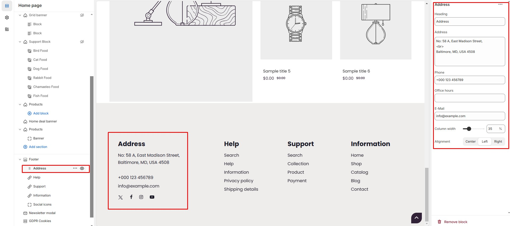

# Address

The **Address Block** in the Footer Section allows you to display your store’s **address, phone number, email, and office hours**, making it easy for customers to get in touch with you.


* **Go to** Shopify Admin > **Online Store > Themes**.
* Click **Customize** on your active theme.
* Navigate to **Footer Section > Add Block > Address** .
* Configure the settings as needed.


* **Heading** : Customize the section title.
* **Address** : Add your store’s address.
* **Phone** : Display a contact number.
* **Office Hours** : Mention business hours (e.g., Mon-Fri: 9 AM – 6 PM).
* **E-Mail** : Provide a customer support email.
* **Column Width** : Adjust the **width percentage**.
* **Alignment** : Choose text alignment **( Left,  Center and Right ).**

<figure><figcaption></figcaption></figure>
