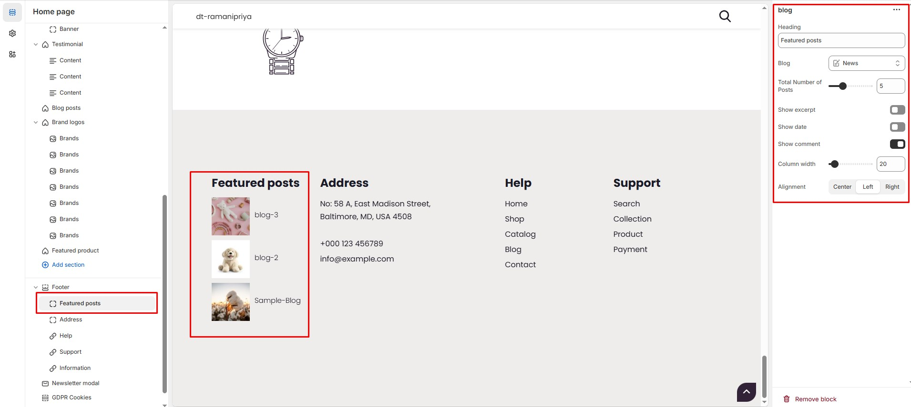

# Blog Block

The **Blog Block** in the Footer Section allows you to display featured blog posts, keeping visitors engaged with the latest updates, news, or articles. This section is useful for sharing insights, announcements, or important information directly from the footer.


* **Go to** Shopify Admin > **Online Store > Themes**.
* Click **Customize** on your active theme.
* Navigate to **Footer Section > Add Block > Blog Block**.
* Configure the settings as needed.


#### Blog Block Settings:

* **Heading:** Customize the section title.
* **Blog:** Select a blog to display posts from.
* **Total Number of Posts:** Choose how many posts to display.
* **Show Excerpt:** Enable or disable post excerpts for a preview of the content.
* **Show Date:** Display the publication date of each post.
* **Show Comment:** Show the number of comments on each post.
* **Column Width** : Adjust the **width percentage**.
* **Alignment:** Choose text alignment ( **Left, Center and Right ).**

<figure><figcaption></figcaption></figure>
