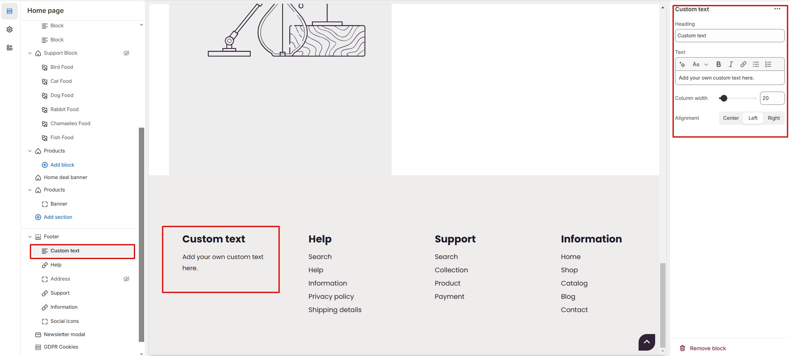

# Custom text

The **Custom text** **Block** in the Footer Section allows you to add **custom text and store details**, making it ideal for sharing **contact information, brand messages, or store policies**.


* Go to **Shopify Admin > Online Store > Themes**.
* Click **Customize** on your active theme.
* Navigate to **Footer Section > Add Block > Custom text.**
* Configure the settings as needed.


* **Heading:** Customize the section title.
* **Text:** Add your own custom message.
* **Column Width:** Adjust the **width percentage.**
* **Alignment:** Choose text alignment **(Left, Center and Right).**

<figure><figcaption></figcaption></figure>
