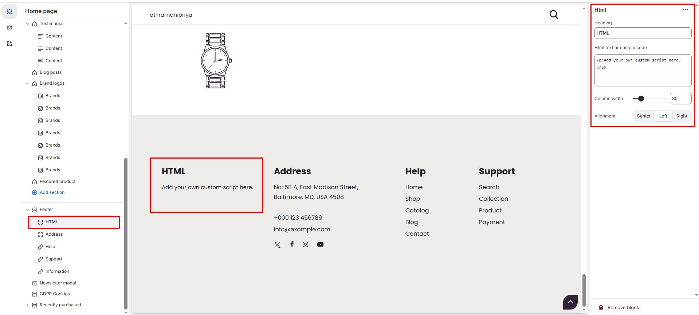

# HTML

The **HTML Block** in the Footer Section allows you to add **custom html** making it ideal for sharing **contact information, brand messages, or store policies**.


* **Go to** Shopify Admin > **Online Store > Themes**.
* Click **Customize** on your active theme.
* Navigate to **Footer Section > Add Block >  HTML**.
* Configure the settings as needed.


* **Heading:** Customize the section title.
* **HTML text or custom code:** Add custom scripts or text.
* **Column Width** : Adjust the **width percentage**.
* **Alignment:** Choose text alignment ( **Left, Center and Right ).**

<figure><figcaption></figcaption></figure>
