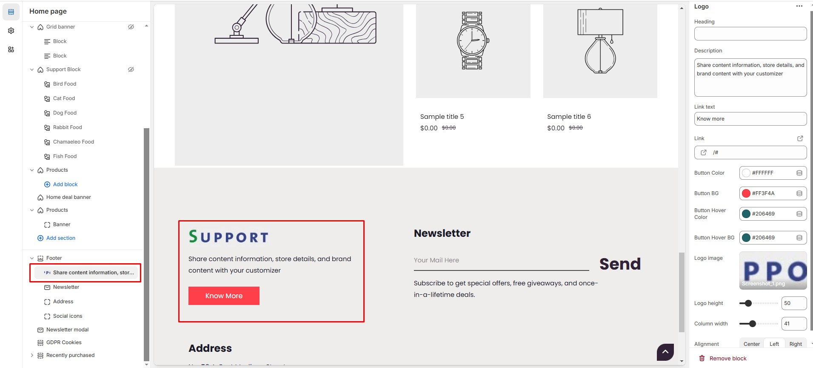

# Logo

The **Logo Block** in the Footer Section allows you to display your store’s **logo** making it ideal for sharing **Branding information**.


* **Go to Shopify Admin > Online Store > Themes.**
* **Click Customize** on your active theme.
* **Navigate to Footer Section > Add Block > Logo.**


* **Heading:** Customize the section title.
* **Description:** Add a short text description.
* **Link Text:** Customize the text for the clickable link
* **Link:** Paste a URL or search for an internal link.
* **Button Color:** Customize button text color (Set Your Preferred Color ).
* **Button Background:** Customize button background color (Set Your Preferred Color ).
* **Button Hover Color:** Customize button hover background color (Set Your Preferred Color ).
* **Button Hover BG:** Customize button hover color (Set Your Preferred Color ).
* **Logo Image:** Upload a custom logo.
* **Logo Height:** Adjust the logo height.
* **Column Width:** Adjust the width percentage.
* **Alignment:** Choose text alignment ( **Left,  Center and Right ).**

<figure><figcaption></figcaption></figure>
