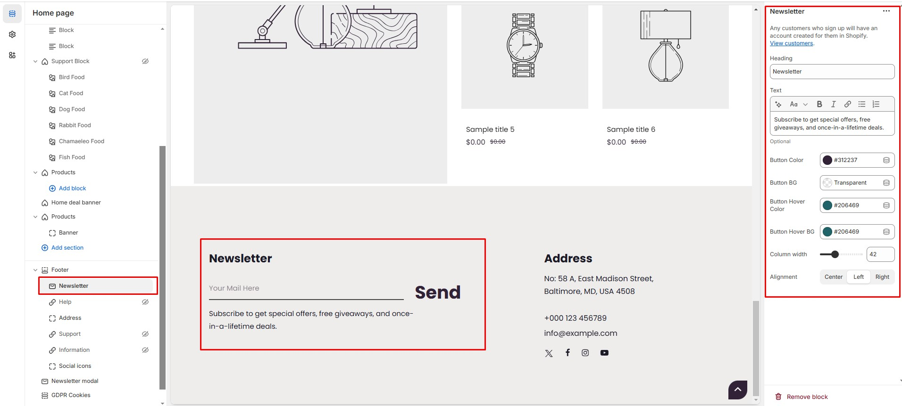

# Newsletter

The **Newsletter Block** in the Footer Section allows customers to **subscribe to email updates, promotions, and brand news**, helping you grow your email marketing list.


* **Go to Shopify Admin >** **Online Store > Themes**.
* Click **Customize** on your active theme.
* Navigate to **Footer Section > Add Block > Newsletter**.
* Configure the settings as needed.


* **Subscribers are added automatically** to your **"accepted marketing" customer list**.
* **Heading:** Customize the section title.
* **Text:** Add your own custom message.
* **Button Color:**  Customize button text color (Set Your Preferred Color).
* **Button Background:** Customize button background color (Set Your Preferred Color).
* **Button Hover Color:** Customize button hover color (Set Your Preferred Color).
* **Button Hover Background:** Customize button background hover color (Set Your Preferred Color).
* **Column Width:** Adjust the **width percentage**.
* **Alignment:** Choose text alignment **(Left,  Center and Right).**

<figure><figcaption></figcaption></figure>


#### Important Note: You need to enable the newsletter and set its placement in the footer settings for the newsletter form to appear.


<figure><figcaption></figcaption></figure>
