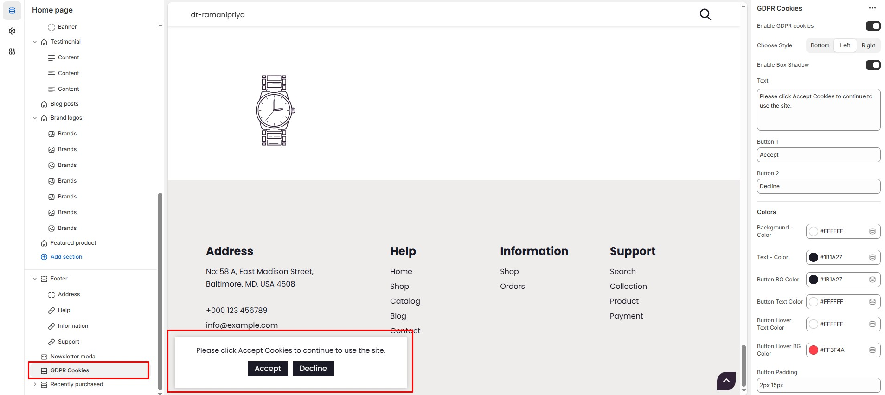
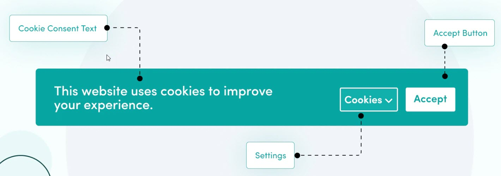

# GDPR Cookies

The **GDPR Cookies Block** in the Footer Section allows you to display a **cookie consent banner**, ensuring compliance with **General Data Protection Regulation (GDPR)** laws by informing visitors about cookie usage on your store.


* **Go to** Shopify Admin > **Online Store > Themes**.
* Click **Customize** on your active theme.
* Navigate to **Footer Section > GDPR Cookies**.
* Configure the settings as needed.


<figure><figcaption></figcaption></figure>

### GDPR Cookies Block Settings:

* **Enable GDPR Cookies:** Toggle to enable or disable the cookie consent banner.
* **Choose Style:** Select the position of the banner (**Bottom, Left, Right**).
* **Enable Box Shadow:** Add a subtle shadow effect for better visibility.
* **Text:** Customize the cookie message (Default: "Please click Accept Cookies to continue to use the site.").

### Button Settings:

* **Button 1:**  Add button text **"Accept"** (Allows cookies).
* **Button 2:** Add button text **"Decline"** (Rejects cookies).

### Color Customization:

* **Background Color:** Customize Background color (Set Your Preferred Color).
* **Text Color:** Customize text color (Set Your Preferred Color).
* **Button Background Color:**  Customize button background color (Set Your Preferred Color).
* **Button Text Color:**  Customize button text color (Set Your Preferred Color).
* **Button Hover Text Color:** Customize button hover text color (Set Your Preferred Color).
* **Button Hover Background Color:** Customize button hover background color (Set Your Preferred Color).

### Button Padding:

* **Padding (Top, Bottom,Left,Right):** Adjust spacing around button in the section.

<figure><figcaption></figcaption></figure>
