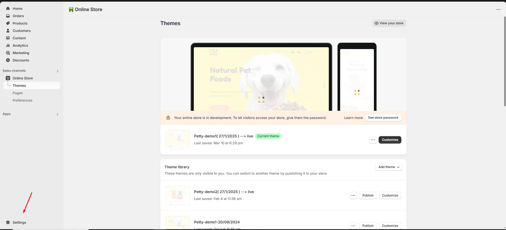
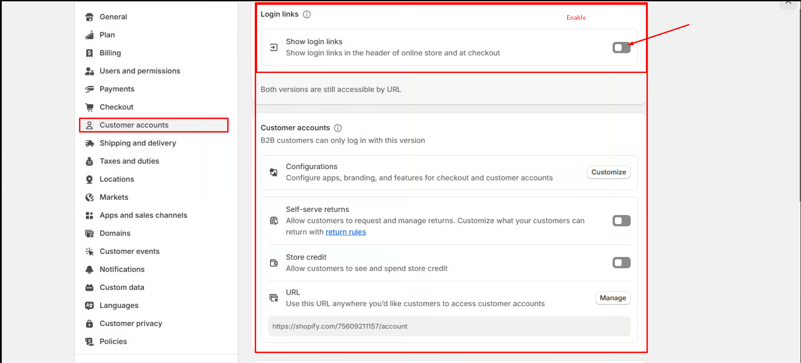

# Account Page

The **Account Page** in Shopify is where customers can log in, view their order history, manage their addresses, and update account details.

### How to Enable the Customer Account Page: 


* After enabling the account option in **Header** its must also be enabled in **Dashboard Panel** for visibility
* **Log in** to your Shopify admin panel.
* Go to dashboard panel **Settings > Customer accounts.**
* Enable **Show login links**
* The change made will **Automatically Save**  with the popup message ad **settings saved**
* Customers can access the account by  **"Sign in"** or **"Log in"** link after enabling it in header.


<figure><figcaption></figcaption></figure>

<figure><figcaption></figcaption></figure>
