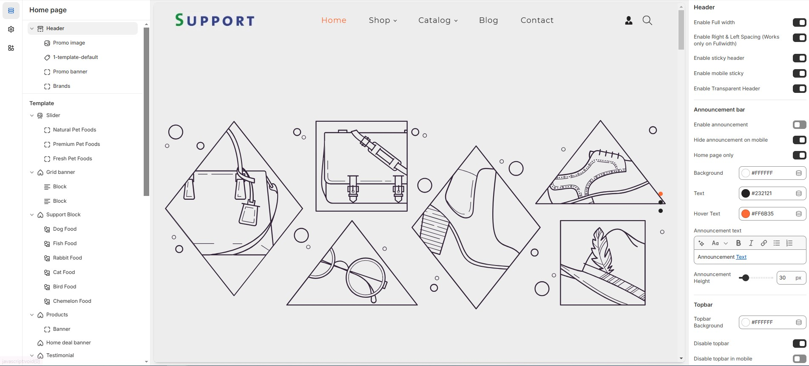
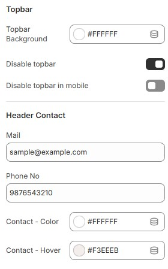

# Header Section

The **Header Section** is a key part of your Shopify store, appearing at the top of every page. It contains your **logo, navigation menu, search bar, shopping cart icon, and additional links**.

<figure><figcaption></figcaption></figure>


* **Go to** Shopify Admin > Online Store > Themes.
* **Click** Customize on your active theme.
* **Navigate to** the **Header Section** in the Theme Editor.


<figure><figcaption></figcaption></figure>

### Header&#x20;

* **Show Full Width:** Expands the header section across the entire screen width.
* **Enable Right & Left Spacing( (Works only on Fullwidth):** Adds spacing on both sides (only works in Full Width mode).
* **Enable Sticky Header:** Keeps the header fixed at the top while scrolling.
* **Enable Mobile Sticky:** Makes the header sticky on mobile devices.
* **Enable Transparent Header:** Allows the header background to be transparent.

### **Announcement Bar**

* **Enable Announcement Bar:** Displays an announcement bar at the top.
* **Hide Announcement on Mobile:** Option to hide the announcement bar on mobile.
* **Home Page Only:** Displays the announcement bar only on the homepage.
* **Background:** Customize the announcement background color as per your needs (Set your preferred color).&#x20;
* **Text:** Customize the announcement text color as per your needs (set your preferred color).
* **Hover Text:** Customize the announcement text Hover color as per your needs (set your preferred color).
* **Announcement text:** Customize the announcement bar text.
* **Announcement Height:** Adjust the height (e.g., 30px).

<figure><figcaption></figcaption></figure>

### **Topbar**

* **Topbar Background:** Customize the topbar background as per your needs (Set Your Preferred Color).
* **Disable Topbar:** Option to hide the topbar if not required.
* **Disable Topbar in mobile:** Allows hiding the topbar on mobile devices.

### Header contact

* **Mail & Phone no:** Display contact details such as email and phone.
* **Contact Color:** Customize the contact text color (Set Your Preferred Color).
* **Contact Hover:** Customize the contact hover color (Set Your Preferred Color).\

<figure><figcaption></figcaption></figure>

### Logo Customization:

* **Logo Image:** Upload a custom logo.
* **Custom Logo Width:** Adjust logo width (e.g., 100px).
* **Logo & Menu Alignment:** Set logo position **\[Logo left, Logo top left, Logo center, Menu bottom ]**.

### Mobile Menu Settings:

* **Mobile Menu Start From:** Adjust when the mobile menu appears **\[default: 1200px].**
* **Enable Social Links:** Show social media icons in the header.

### Search Settings:

* **Search Type:** Choose between icon or none.
* **Enable Predictive Search:** Allows users to see search suggestions.

### **Social Icon Colors:**

* **Social Icon Color:** Personalize the social icon color to match your preferences (Choose Your Desired Color).
* **Social Icon Hover:** Personalize the hover color of social icons to suit your preferences (Choose Your Desired Color).
* **Social Icon Background:** Personalize the background of social icons to match your preferences (Choose Your Desired Color).
* **Social Icon Hover Background:** Customize the background color that appears on hover for social icons to match your preferences (Set Your Desired Color).

### **Header Icons:**

* **Enable Account Link:** Display a login/account link [**(should also enable in dashboard settings)**](account-page.md).
* **Enable Cart:** Show a shopping cart icon in the header.
* **Enable Wishlist:** Option to enable wishlist and add favorite products.
* **Enable Compare It:** Option to enable compare product and comparison of features.

### **Header Icon colors:**

* **Icon Color:** Customize the icon color (Set Your Preferred Color).
* **Icon Hover Color:** Customize the icon hover color (Set Your Preferred Color).
* **Icon Background:** Customize the icon background color (Set Your Preferred Color).
* **Icon Hover Background:** Customize the icon hover background color (Set Your Preferred Color).

### **Menu Settings:**

* **Enable Menu Indicator:** Display indicators for active menu items.
* **Primary Menu:** Select the main [**navigation menu**](navigation-menu.md).
* **Enable Secondary Menu:** Option to add an additional secondary menu.
* **Secondary Menu:** Select the secondary [**navigation menu**](navigation-menu.md).
* **Header Background:** Customize the menu background color (Set Your Preferred Color).
* **Menu Text Color:** Customize the menu text color (Set Your Preferred Color).
* **Menu Active Text Color:** Customize the active menu text color (Set Your Preferred Color).
* **Menu Active Background:** Customize the active menu background color (Set Your Preferred Color).
* **Mega Menu Background:** Customize the background for the mega menu (Set Your Preferred Color).
* **Sub Menu Text Color:** Customize the sub-menu text color (Set Your Preferred Color).
* **Sub Menu Hover Color:** Customize the hover color for sub-menu items (Set Your Preferred Color).
* **Menu Bottom Background Color:** Customize the background color below the menu (Set Your Preferred Color).
* **Bottom Menu Border Color:** Customize the bottom border color (Set Your Preferred Color).
* **Parent Menu Font Size:** Adjust the font size for main menu items (e.g., 18px).
* **Sub Menu Font Size:** Adjust the font size for sub-menu items (e.g., 18px).

### Money Options:

* **Enable Currency** [**Selector**](selectors-language-and-currency.md)**:** Allow users to switch currencies.
* **Display Sale Tag:** Show a sale label for selected menu items.
* **Sale:** Add the tag name as required to the theme
* **Map Sale Tag with Menus:** Enter menu names separated by commas.
* **Display New Tag:** Show a new label for selected menu items.
* **New:** Add the tag name as required to the theme
* **Map New Tag with Menus:** Assign menus for new arrivals.
* **Display Hot Tag:** Show a hot label for selected menu items.
* **Hot:** Add the tag name as required to the theme
* **Map Hot Tag with Menus:** Assign menus for hot-selling items.

### Adding blocks in header

* In header section can click and add a block
* You can select the required block types and create a [megamenu](menu-and-mega-menu/)
* For example you upload a Promo image, add links, or embed menu.
* Added blocks can also be **Reorder** by dragging them up or down.
* Click **save**

