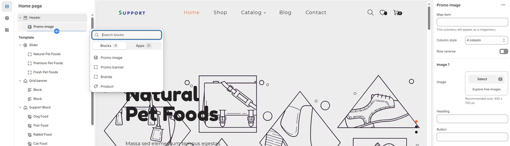

# Menu & Mega Menu

The **Mega Menu** in Shopify allows you to create an **advanced navigation system** with multiple columns, images, and content types, improving user experience and accessibility.


* **Go to** Shopify Admin > **Online Store > Themes**.
* Click **Customize** on your active theme.
* Navigate to **Header Section > Add Block**
* To enable the **mega menu option**


<figure><figcaption></figcaption></figure>

### **Promo Image Menu** 

* Displays **multiple promotional images** within the megamenu.
* Can include **headings, buttons, and links** for each image.

### **Brands Menu** 

* Showcases **brand logos** in a multi-column layout.
* Each logo can be **linked to brand-specific collections**.
* Recommended image size: **250 x 200 px**.

### **Product Menu** 

* Displays **specific products** directly in the megamenu.
* You can select the column layout based on the theme requirements. Available options include (**3, 4, 5, 6, and 1:1:2 columns.)**

### **Promo Banner Menu** 

* Adds **large promotional banners** to the megamenu.
* Includes **headings, buttons, and links** for each banner.
* Recommended image size: **400 x 700 px**.
