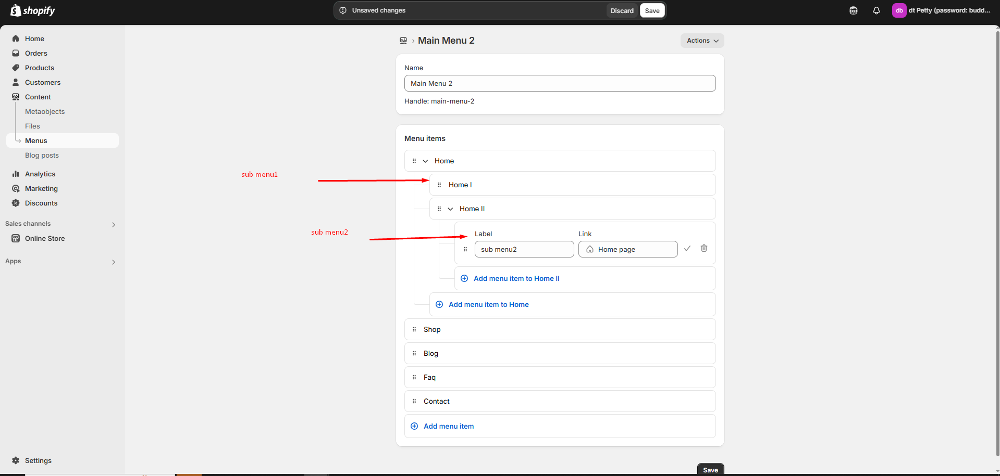

# Navigation menu

A navigation menu in Shopify helps customers easily browse your store by linking to important pages, collections, products, or external URLs.&#x20;

* Go to **Online Store > Content > Menu in your Shopify Admin.**
* Click **"Create Menu"** and enter a Menu Name (e.g., "Main Menu").
* Click **"Add Menu "** and enter a Name **(e.g., "Shop," "About Us," "Contact").**
* Add menu items and add **label and link**
* Click **Link as required** and choose a **destination.** If there is no destination link and error occurs as **(Enter a valid URL or choose a page)**&#x20;
* Click the **Tick icon** to **save** and **delete icon** to **delete**&#x20;

<figure><figcaption></figcaption></figure>


* **Home –** Links to the store’s Homepage.
* **Collections –** Directs to a collection of products.
* **Products –** Links to a specific product.
* **Pages –** Links to an informational pages (e.g., About Us, Contact).
* **Blog Posts –** Links to a blog article.
* **Custom URL –** Add any external or internal link.
* Click **Tick icon** to confirm the menu item.
* Click to **Save.**


### Assigning the Menu to Your Theme 

* Go to **Online Store > Themes > Customize.**
* In header section select the menu created in content&#x20;
* Click **Save**

<figure><figcaption></figcaption></figure>

### Creating Dropdown Menus (Submenus) 

* To create a submenu, drag and drop a menu item below and slightly to the right of another menu item.
* This helps group related items under a main category (e.g., "Shop" > "Men's Clothing", "Women's Clothing").
* Click the Save button to Save the Menu

<figure><figcaption></figcaption></figure>
