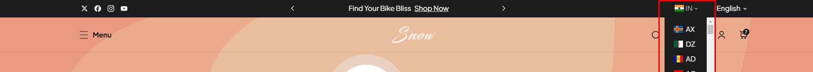
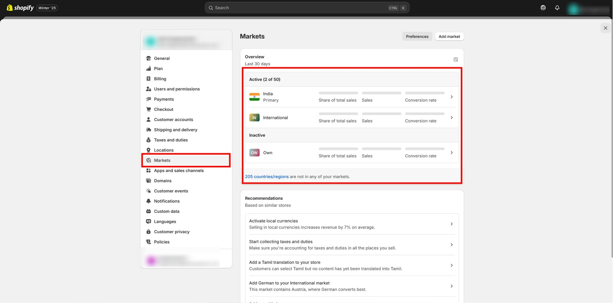
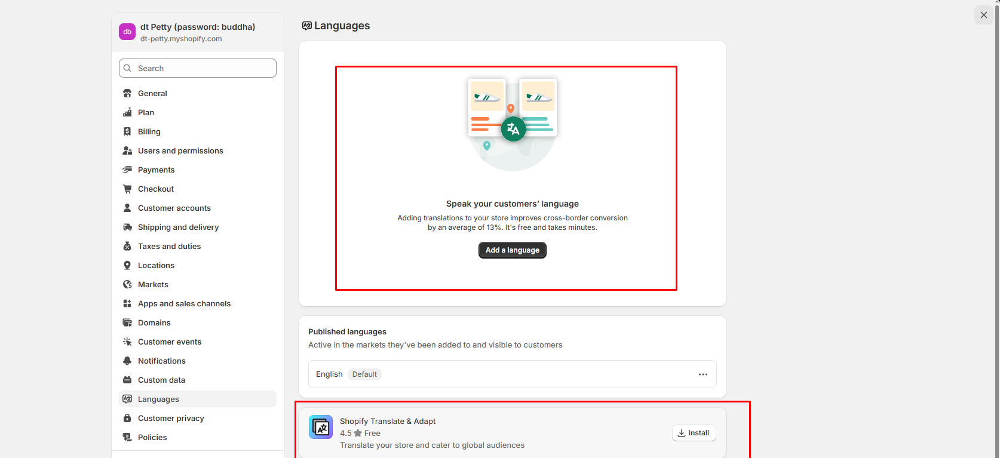
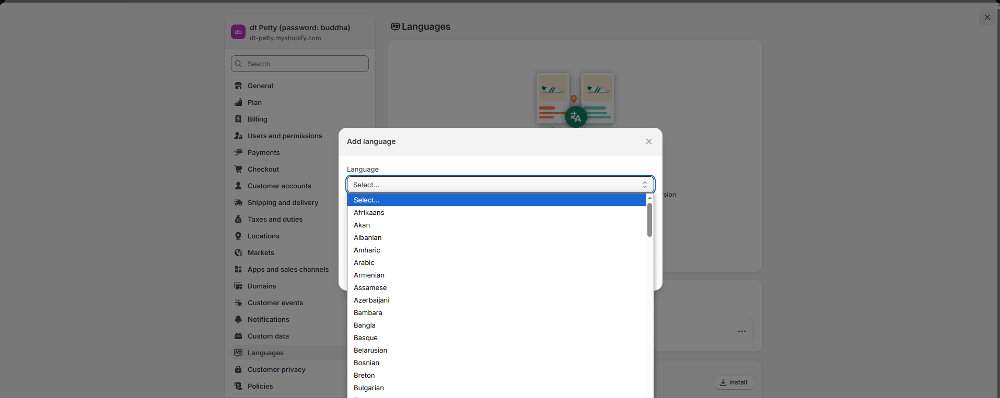

# Selectors (Language & Currency)

### Currency Selector 

Shopify now allows stores to allow customers to shop and check out in their local currency. This is a very positive thing because buyers are much more likely to have a good experience shopping in their own currency and finalize their purchase knowing that they will not incur any additional fees from their bank.

<figure><figcaption></figcaption></figure>

* Set up your store’s Markets under **Online Store > Settings** This defines the regions that you sell to (you would have had to do this already to set up international shipping rates).
* Activate local currencies. Go to **Settings > Markets > International** (or other Market) **> Active.**&#x54;his will turn on the multi-currency shopping experience for the selected market. Ensure that your regions in payment settings match your shipping zones.
* Show the currency selector in the header.

<figure><figcaption></figcaption></figure>

### Language Selector 

* Open **Admin Store Settings > Languages > Install translate & adapt app ( Shopify Translate & Adapt).**
* Click **Add language > Select language > add.** Then publish the **Selected language > Translate** option in the selected language
* Click on the app which appears on the **Translate >** It popup to next page and then **click auto-translate.**
* Wait for a few more minutes. Let the translation be completed.
* Check with the theme by switching to **Another language.**

<figure><figcaption></figcaption></figure>

<figure><figcaption></figcaption></figure> <figure><figcaption></figcaption></figure>

<figure><figcaption></figcaption></figure>
