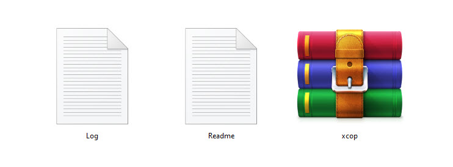
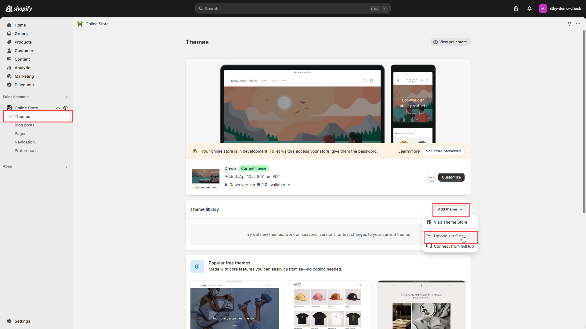
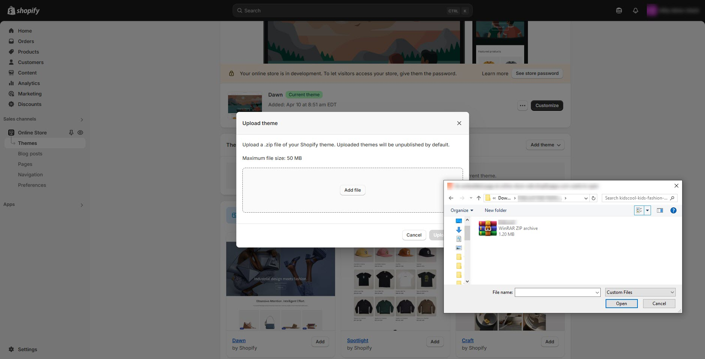
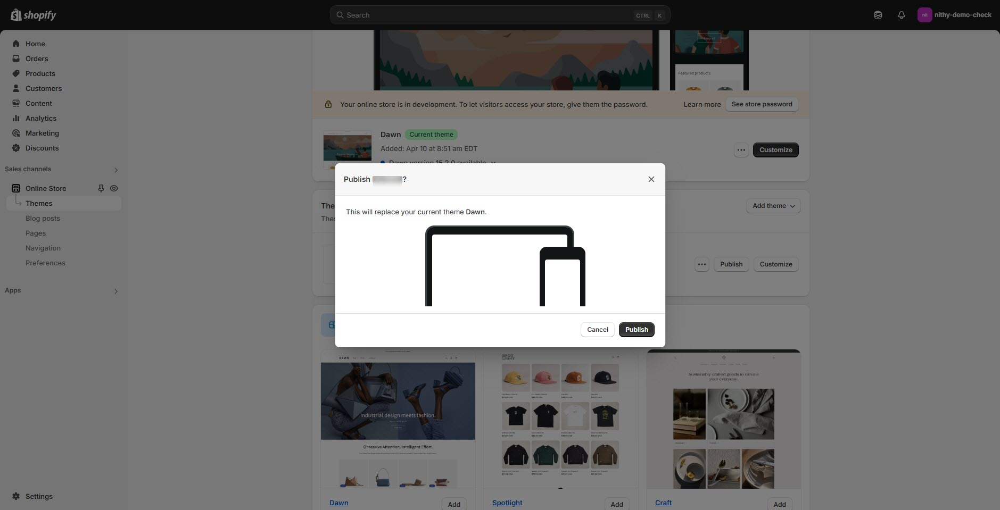

# Theme Installation


Before installing the theme, please unzip "**themeforest-xxxxxx-xcop-projector-single-product-shopify-theme.zip**" and upload the "**xcop.zip**" file to Shopify to avoid the ["layout/theme.liquid" missing template](https://blueskytechco.gitbook.io/glozin-shopify/frequently-asked-questions/missing-template-layout-theme.liquid) error.


### **Theme** Extractions 


* Download the package from [Themeforest.net](https://themeforest.net/) (it will be in ZIP format).
* Find the file **"themeforest-xxxxxx-xcop-projector-single-product-shopify-theme.zip"** in your folder.
* Extract the contents of the **ZIP** package you just downloaded.
* Upload the **xcop.zip** file to your Shopify store.


📂 **themeforest-xxxxxx-xcop-projector-single-product-shopify-theme.zip**

<figure><figcaption></figcaption></figure>

#### Upload Theme Through Shopify Admin Panel 

<figure><figcaption></figcaption></figure>


* **Log in** to the Shopify Panel.
* Click **"Online Store"** from the left-hand menu.
* Click **"Add theme" > "Upload zip file."**
* Select and upload the **xcop.zip** file. The theme will then be uploaded to your store.
* Once the upload is complete, click **"Publish."**


<figure><figcaption></figcaption></figure>

<figure><figcaption></figcaption></figure>

### [How to install Shopify theme](https://youtu.be/1nKm4hy-EnQ) 


