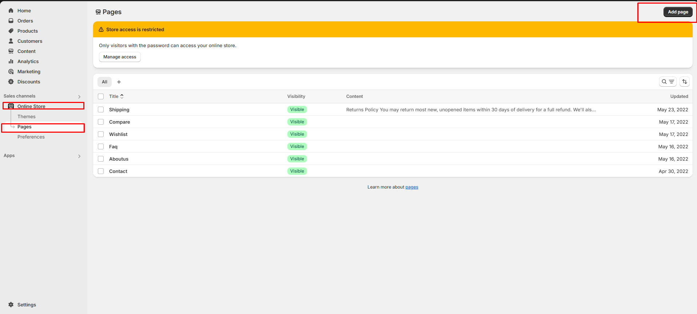

# Contact

In a **Shopify theme**, the **Contact Us** page is a built-in or customizable section that allows customers to reach out to the store owner for enquiries, support, or business-related questions.

### How to create Contact page 


**Step 1 :** Go to **Online Store > Pages**.

**Step 2 :** Click the **Add page**. It navigates to another page

**Step 3 :** Enter the page **Title**.(Eg: Contact)

**Step 4 :** Select the **Contact** template from the **Theme template** drop-down menu in the **Online Store** sectio&#x6E;**.**

**Step 5 :** Add content, media, etc. in the **Customizer**

**Step 6 :** **Save** the changes.


<figure><figcaption></figcaption></figure>

<figure><figcaption></figcaption></figure>

### Contact Page Customization 


**Step 1 :** Go to **Online Store > Themes > Customize**

**Step 2 :** Select the **Contact** page in the **Customize  > Add Section > Form Image , Contact Form or Contact section**_**.**_&#x49;f available or can use the default contact options

**Step 3 :** Select a  section from the left side to enter the details or Edit in default section as contact options

**Step 4 :** Enter the required details for the section in the right sidebar.

**Step 5 :** Provide the Heading and Description.

**Step 6 :** Enter the essential factors for the contact page, such as the Address, Phone number, Email, etc.

**Step 7 :** Set the section padding.Allow to add spacing in top and bottom

**Step 8 :** Then add your custom class name if needed.

**Step 9 : Save** the process

**Step 10 :** Click the preview in right side to see the changed made.


<figure><figcaption></figcaption></figure>

### Contact Options 

* **Show Full Width:** Expands the contact section across the entire screen width.
* **Enable Right & Left Spacing (Works only on Fullwidth):** Adds spacing on both sides (works only in Full Width mode).
* **Padding (Top, Bottom):** Adjust the inner spacing above and below the section. Top(px), Bottom(px).
* **Margin (Top, Bottom):** Adjust the outer spacing above and below the section. Top(px), Bottom(px).
* **Main Heading:** Customize the Main heading.
* **Sub Heading:** Add a short text to the content.
* **Description:** Add text to share information about the collection.
* **Link Text:** Customize the text for the clickable link.
* **Link URL:** Paste a URL or search for an internal link.

### **Section Color settings**

* **Heading Color:** Customize the heading color (Set Your Preferred Color).
* **Sub Heading Color:** Customize the sub-heading color (Set Your Preferred Color).
* **Description Color:** Customize the description text color (Set Your Preferred Color).
* **Button Background Color:** Customize the button background color (Set Your Preferred Color).
* **Button Text Color:** Customize the button text color (Set Your Preferred Color).
* **Button Hover Background Color:** Customize the hover background color for buttons (Set Your Preferred Color).
* **Button Hover Text Color:** Customize the hover text color for buttons (Set Your Preferred Color).
* **Heading position** : Choose heading positio&#x6E;**( Left, Right, Center )**.
* Layout Type: Choose the layout type **(Block layout, Left Map + Form, Left Map + Icon Block, Left Icon Block + Form).**

### **Map Section**

* **Enable Map Section:** Allows adding a Map Section.
* **Map Code\[Iframe]:** Iframe code [Where do I find googlemap action URL?](https://support.google.com/maps/answer/3544418?hl=en)

### **Contact-Info Section**

* **Enable Contact Info Section:** Allows adding a contact info section.
* **Contact Border Color:** Customize the contact border color (Set Your Preferred Color).
* **Contact Hover Border  Color:**  Customize the contact border hover color (Set Your Preferred Color).
* **Contact Icon Heading Color:**  Customize the contact icon heading color (Set Your Preferred Color).
* **Contact Icon Bg Color:**  Customize the contact icon background color (Set Your Preferred Color).
* **Contact Icon Color:**  Customize the contact icon color (Set Your Preferred Color).
* **Contact Icon Hover Bg Color:**  Customize the contact icon hover background color (Set Your Preferred Color).
* **Contact Icon Hover Color:**  Customize the contact icon hover color (Set Your Preferred Color).
* **Enable Phone:** Allows adding a enable phone.
* **Title:** Customize the phone title.
* **Icon Class:** Customize the icon class **(eg., fa fa-phone).**
* **Phone 1:** Customize the phone number.
* **Phone 2:** Customize the phone number.
* **Enable Email :** Allows adding a enble email.
* **Icon Class:** Customize the icon class **(eg., fa fa-envelope).**
* **Title:** Customize the email title.
* **Email 1:** Customize the email id.
* **Email 2:** Customize the email id.
* **Enable Address:** Allows adding a enble address.
* **Title:** Customize the address title.
* **Icon Class:** Customize the icon class **(eg., fa fa-location-arrow).**
* **Address 1:**  Customize the Address.
* **Address 2:** Customize the Address.

### **Contact-Form Section**

* **Enable Contact-form Section:** Allows adding a contact form section.
* **Form Title:** Customize the Form title.

### Page Creation 


