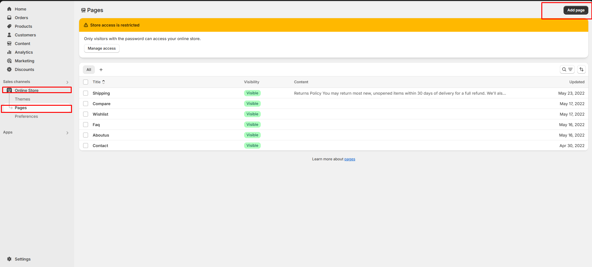
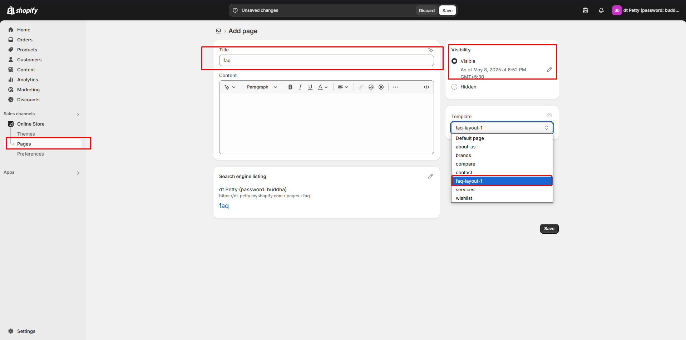
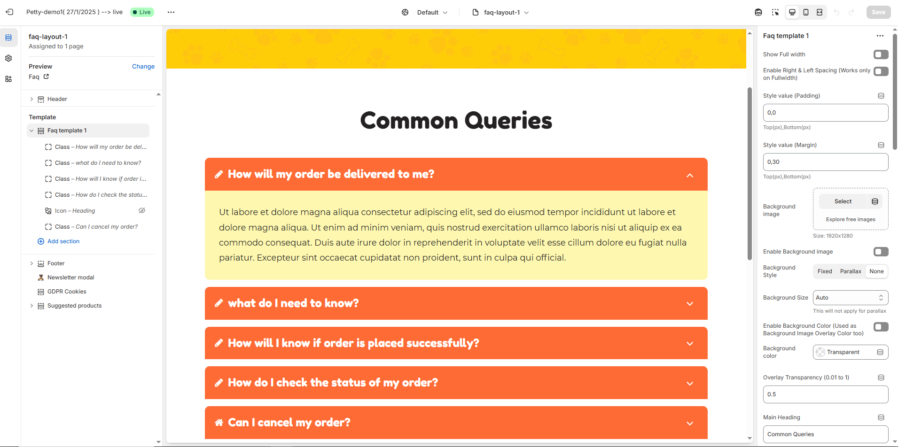

# FAQ page

The **FAQ page** addresses common questions to help users find answers quickly and improve their experience on the website.

### How to create faq page 


**Step 1:** Go to **Online Store > Pages.**

**Step 2:** Click the **Add page**, it navigates to another page.

**Step 3:** Enter the required **Title** for the page.

**Step 4:** Select **FAQ** from the **Theme template** drop-down menu in the **Online Store** sectio&#x6E;**.**

**Step 5:** Add content, media, etc. in the **customizer.**

**Step 6: Save** the changes.


<figure><figcaption></figcaption></figure>

<figure><figcaption></figcaption></figure>

#### Customization of FAQ 


To add questions and answers to the **FAQ**, follow the steps below.

**Step 1 :** Go to **Online Store > Themes > Customize**

**Step 2 :** On the left sidebar, you can add sections for the faq.

**Step 3 :** Select the FAQ page from the **Customizer > Add Section > Faq or Collapsible Content**

**Step 4 :** Select a **Collapsible row** to add **Question ,Answer and subheading with icons.**

**Step 5 :** On the right sidebar, you can give the questions,answers,subheading and icon for faq.

Heading as Question and Row content as Answer for the Question.

**Step 6 :** **Save** the process.


<figure><figcaption></figcaption></figure>

### **Faq Template Customization**

* **Show Full Width:** Expands the featured frequently asked question section across the entire screen width.
* **Enable Right & Left Spacing (Works only on Fullwidth):** Adds spacing on both sides (works only in Full Width mode).
* **Padding (Top, Bottom):** Adjust the inner spacing above and below the section. Top(px), Bottom(px).
* **Margin (Top, Bottom):** Adjust the outer spacing above and below the section. Top(px), Bottom(px).
* **Enable Background Image:** Allows adding a background image for the section.
* **Background Image:** Upload the image (Recommended size based on design requirements).
* **Background Style:** Choose background style **( Fixed, Parallax, or None )**.
* **Background Size:** Choose background size **( Auto, Cover, Contain, Repeat)**.
* **Enable Background Color:** Enable a background color (also used as an overlay color).
* **Overlay Transparency:** Adjust the transparency of the overlay (value between `0.01` and `1`).
* **Main Heading:** Customize the Main heading.
* **Sub Heading:** Add a short text to the content.
* **Description:** Add text to share information about the collection.
* **Link Text:** Customize the text for the clickable link.
* **Link URL:** Paste a URL or search for an internal link.

### **Color Customization** 

* **Heading Color:** Customize the heading color (Set Your Preferred Color).
* **Sub Heading Color:** Customize the sub-heading color (Set Your Preferred Color).
* **Description Color:** Customize the description text color (Set Your Preferred Color).
* **Button Background Color:** Customize the button background color (Set Your Preferred Color).
* **Button Text Color:** Customize the button text color (Set Your Preferred Color).
* **Button Hover Background Color:** Customize the hover background color for buttons (Set Your Preferred Color).
* **Button Hover Text Color:** Customize the hover text color for buttons (Set Your Preferred Color).
* **Heading position** : Choose heading position **(Left, Right, Center)**.

### **Block Settings**

* **Block Style:** Choose the block style **(Style 1,Style 2, Style 3, Style 4).**
* **Block Text Position:** Choose text position **(Left, Right, Center)**.
* **Overall Radius:** The overall radius can be rounded using the radius property. (Leave empty for default border radius).
* **Grid gap:** Customizer spacing between columns.
* **Enable Box Shadow:** Adds a shadow effect to the banner.
* **Enable Heading Icon/Image (Set the icon/image inside the blocks):** Allows adding a Icon and Image.
* **Heading Icon / Image size:** Customizer icon and image size.

### **Segmented Layout:**

* **Enable Segmented Layout:** Allows adding a segmented layout.
* **Segmented Layout Gap:** Customizer spacing between segmented layout column.

### **Block Color Settings:**

* **Faq Border Color:** Customize the faq border color (Set Your Preferred Color).
* **Faq Heading Color:** Customize the faq  heading color (Set Your Preferred Color).
* **Faq Heading Bg Color:** Customize the faq  heading background color (Set Your Preferred Color).
* **Faq Content Color:** Customize the faq  content color (Set Your Preferred Color).
* **Faq Content Bg Color:** Customize the faq content background color (Set Your Preferred Color).
* **Image:** Upload the image (Recommended size based on design requirements).

### **Icon**

* **Icon (Enable Heading Icons from section settings) :** Upload the image (Recommended size based on design requirements).
* **Heading :** Customize the Heading.
* **Description :** Add text to share information about the description.

### **Class**

* **Font Awesome class (Enable Heading Icons from section settings) :** Add the font awesome icon (Eg., fa fa-instagram).
* **Heading :** Customize the Heading.
* **Description :** Add text to share information about the description.

#### **Advanced Customization** 

* [**Custom Class:**](https://wdtsupport.gitbook.io/shopify-os/custom-class) The Shopify allows you to apply unique CSS styles to specific sections, blocks, or elements within your theme.
