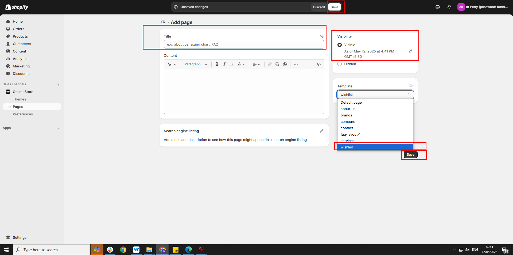
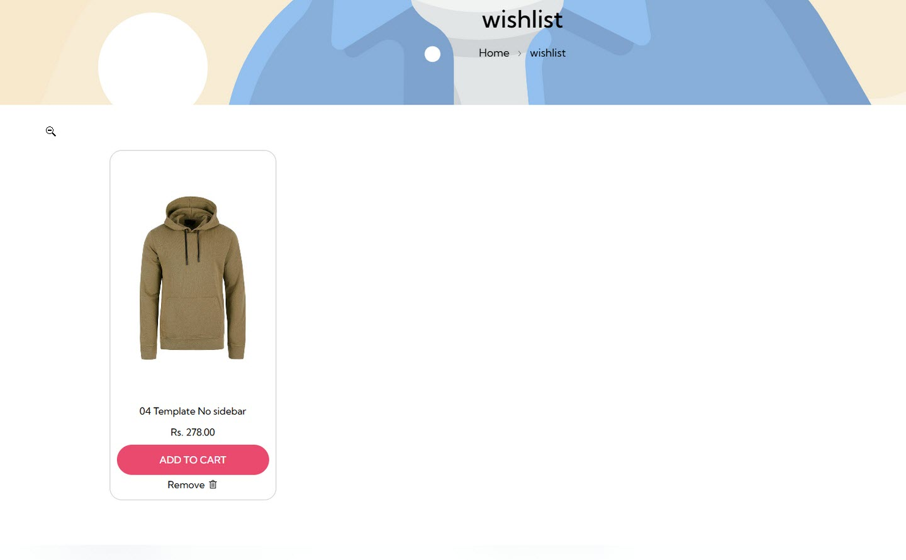

# Wishlist

A **Wishlist** page lets users save and track items they’re interested in for future purchase


**Step 1:** Go to **Online Store > Pages.**

**Step 2:** Click the **Add page,** it navigates to another page.

**Step 3:** Enter the required **Title** for the page.

**Step 4:** Select **Wishlist** from the **Theme template** drop-down menu in the **Online Store** sectio&#x6E;**.**

**Step 5:** **Save** the changes.


<figure><figcaption></figcaption></figure>

<figure><figcaption></figcaption></figure>


The wishlist can be enabled in header section or in product detail page. It is used to save the favorite products


<figure><figcaption></figcaption></figure>
