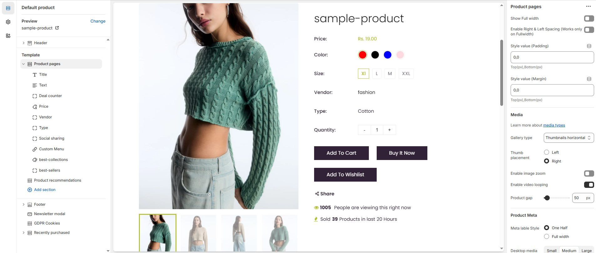

# Default Product

The **Product** section in Shopify is where you configure how a product appears on the **product detail page** (PDP). It controls everything from product title and price to images, buttons, and more.&#x20;

* **Show Full Width :** Expands the collection section across the entire screen width.
* **Enable Right & Left Spacing :** Adds spacing on both sides (works only in Full Width mode).
* **Style Value (Padding ) :** Adjust the inner spacing above and below the section. Top(px), Bottom(px).
* **Style Value (Margin ) :** Adjust the outer spacing above and below the section. Top(px), Bottom(px).

### **Media**

* **Gallery type :** Choose the gallery type **(Thumbnails horizontal, Thumbnails Vertical or Hide Thumbnails)**&#x20;
  * **Thumbnails Horizontal :**  Thumbnails appear on the left side or right side of the main image.
  * **Thumbnails Vertical :** Thumbnails appear below the main image.
  * **Hide Thumbnails :** Hide the Thumbnails of the main images.
* **Thumb Placement :** Choose the thumb placement **(Left or Right).**
* **Enable Image Zoom :** Enable or diable the image zooming.
* **Enable Video Looping :** Enable or disable the continuous video looping.
* **Product Gap :** Customizer spacing between columns.

### **Product Meta**

* **Meta Label Style :** Choose the meta style **(One half or Full width).**
  * **Desktop Media Size :** Choose the media size **(Small , Medium or Large)**.
* **Enable Review :** Enable or disable the product review.
* **Enable Product Swatches :** Enable or disable the product color and sizes.
* **Enable Stock Status :** Enable or disable the product available status.
* **Enable Back In Stock :** Enable or disable the back in stack.
* **Enable Quantity Selector :** Enable or disable the quantity selector.
* **Enable Buynow :** Enable or disable the buynow button.
* **Hide Add to cart :** Displays or hides the shopping Add to Cart icon.
* **Enable Wishlist :** This option allows you to display or hide the button for adding items to a [**wishlist**](../pages/wishlist.md)**.**
* **Show Social Sharing Button :** Enable the Social media button.

### **Tab Section**

* **Tab Position :** Choose the tab position for the product description **(Right or Bottom)**.
* **Tab Style :** Choose the tab style for the product description  **(Tab or Toggle)**.
* **Enable Product Description :** Enable or disable the product descriptiom.
* **Tab 1 :** Customize the Tab or Toggle heading.
* **Enable Shipping Details :** Enable or disable the shipping details on the main product page.
* **Tab 2 :** Customize the Tab or Toggle heading.
* **Select the page :** Select the page (eg., shipping details).
* **Enable Product Review :** Enable or disable the product review in the Tab or Toggle view.
* **Tab 3 :** Customize the Tab or Toggle heading.
* **Show Enquiry Form :**   Enable or disable the enquiry form is a document used to collect queries or requests from customers.
* **Show Sticky Cart :**  Enable or disable the skicky cart in main product page.

<figure><figcaption></figcaption></figure>

### **Product Block Settings**

* **Title :** Choose the product default product title is displayed.
* **Text :** Customize the Short description.
* **Deal Counter , Price , Vendor, Social sharing, Notify Form, Sku or Size chart :** Choose the product  default product information to displayed (No customizable settings available).
* **Custom Menu :** Customize the title and menu.
* **Image :** Customize the heading, choose the image and custom Button text and link url.
* **Product List :** Customize the heading, select the collection, and set the collection limit.
* **Product Carousel :** Customize the heading, select the collection, and set the collection limit.
