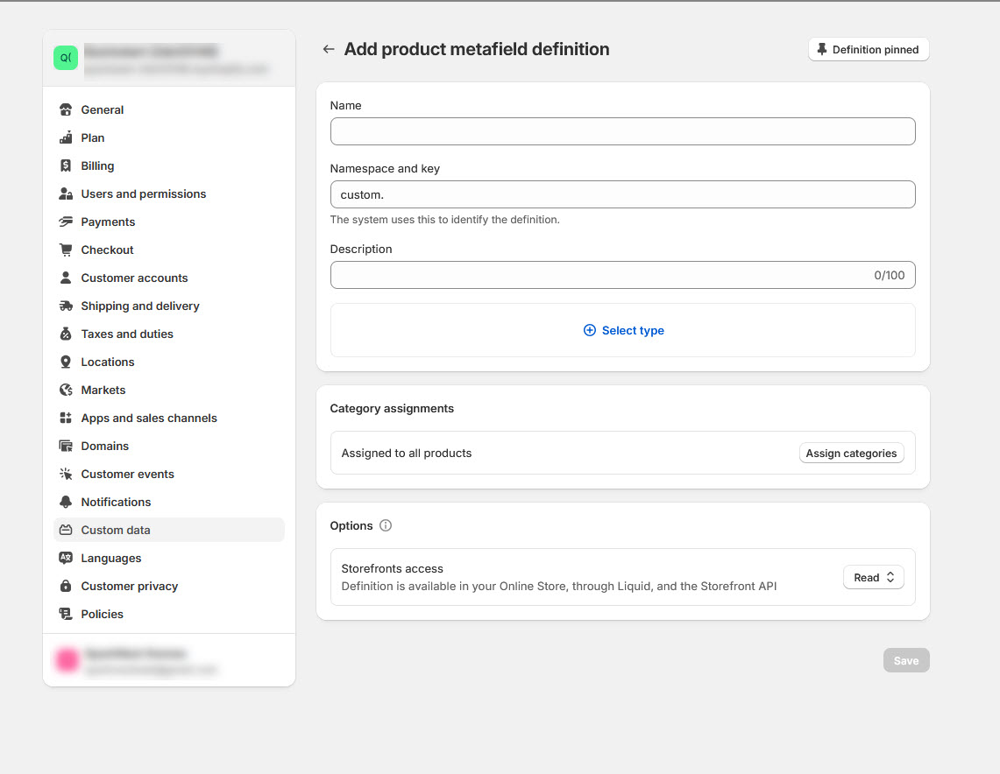
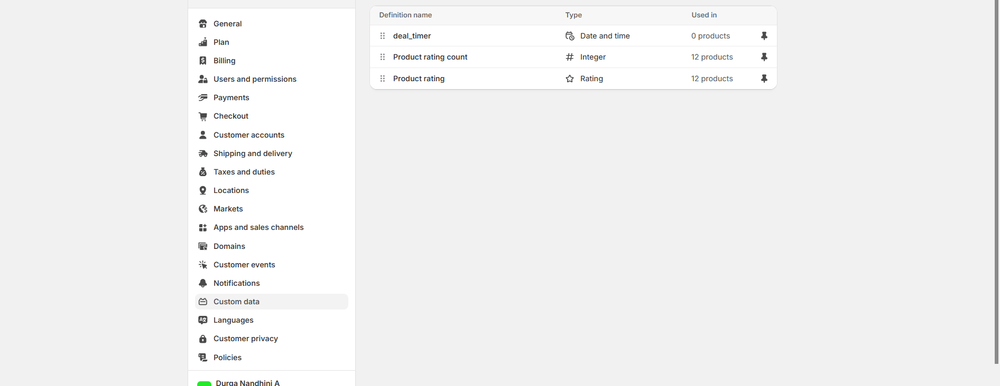
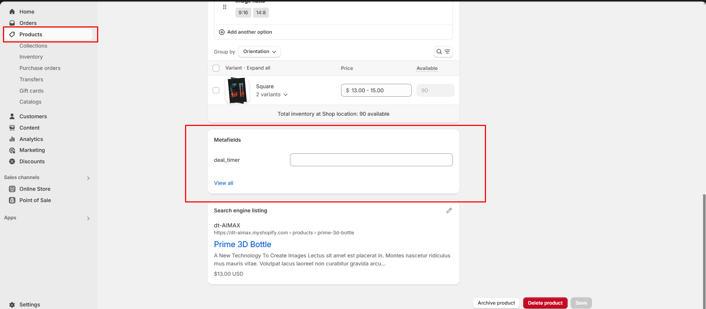

# Metafield

**Metafields**: Custom fields to store additional information about products, collections, customers, orders, etc.How to Add Metafields:

### Why Use Recommended Products? 


* **Log in** to Shopify Admin.
* Click **Settings** in the left-hand menu.
* Select **Settings > Custom data > select any metafield Eg:(Products) > Add definitions**


<figure><figcaption></figcaption></figure>

### Steps to Create a New Metafield Definition: 


* Click **Add Definition**.
* Enter a **Name** (e.g., "deal\_timer").
* Select a **Namespace & Key** (e.g., `custom.deal_timer`).
* Choose a **Type** (e.g.,date and time) and set minimum and maxmium value
* Click **save**


<figure><figcaption></figcaption></figure>

#### Adding and Using Metafields in Shopify 


* Go to **Products** in the Shopify Admin.
* Select a **Product** and scroll down to the **Metafields** section.
* Click **Add Value** and enter the required information.
* Click **Save**.


#### Display Metafields on Product Pages 


* **Go to** Shopify Admin > **Online Store > Themes**.
* Click **Customize** on your active theme.
* Enable product deal timer
* It will be visible in the products


<figure><figcaption></figcaption></figure>

