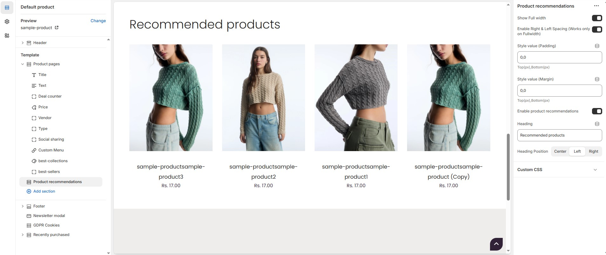

# Product Recommendations

Recommended Products are suggestions displayed to customers based on their browsing or purchasing behaviour, product characteristics, or popular items.

### Why Use Recommended Products? 

* **Increase Sales :** Encourages customers to explore and purchase more.
* **Cross-Selling and Upselling :** Suggest complementary or premium versions of products.
* **Personalization :** Improves the shopping experience by tailoring suggestions to the customer.
* **Discoverability :** Showcases products that customers may not have searched for directly.

### How to enable recommended Products? 


* **Go to** Shopify Admin > **Online Store > Themes**.
* Click **Customize** on your active theme.
* Navigate to **Products > Default product >** **Product Recommendations**. (available in bottom of the customizer **ref below screenshot**)
* Configure the settings as needed.


<figure><figcaption></figcaption></figure>

* **Show Full Width:** Expands the section across the entire screen width.
* **Enable Right & Left Spacing:** Adds spacing on both sides (Works only in Full Width mode).
* **Padding (Top, Bottom):** Adjust spacing above and below the section.
* **Margin (Top, Bottom):** Adjust margin above and below the section.
* **Enable Product Recommendations :** Enable or disable the product recommendations.
* **Heading :** Customize the Heading  (Eg., Recommended Products).
* **Heading Position :** Choose Heading Position alignment (**Left, Center, Right**).

\
