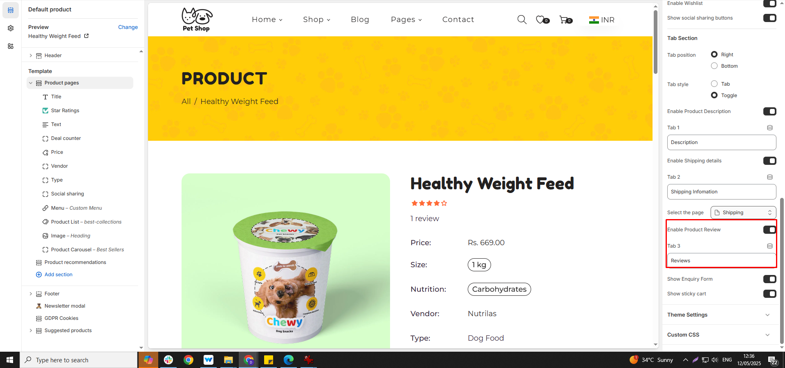

# Product review

Shopify doesn’t have built-in product reviews, but you can add them using Shopify apps or by customizing your theme.

* Go to **Shopify Admin > Apps**
* In search bar search for the required apps (For example for product review app search for Judge me app)
* Search for **“judge.me Review ”** by Shopify
* Click **Add app** and **install it**
* Follow the setup instructions to add the review section to your product pages [**(App Integration)**](https://wedesignthemes.gitbook.io/ai-max-ai-games/app-integration/app-integration)


Kindly enable the Rating **(Product Pages ) ,** to display in product detail page kindly and app and embed it


<figure><figcaption></figcaption></figure>

<figure><figcaption></figcaption></figure>

<figure><figcaption></figcaption></figure>
