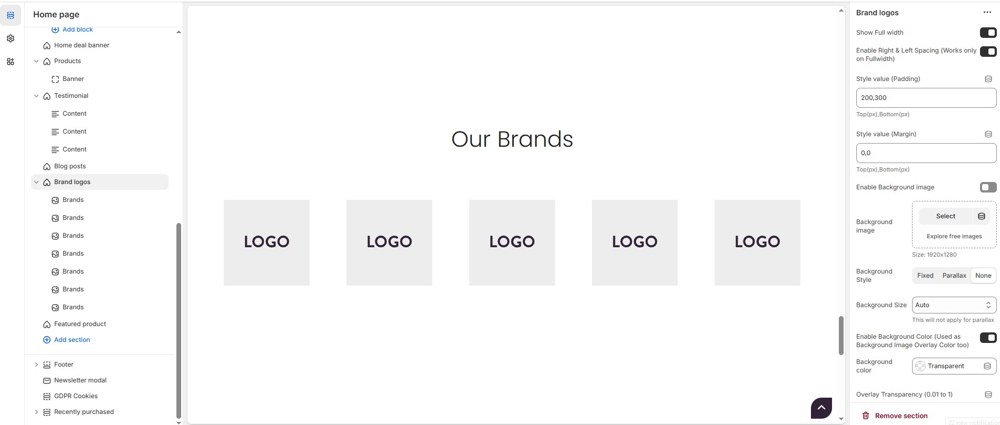
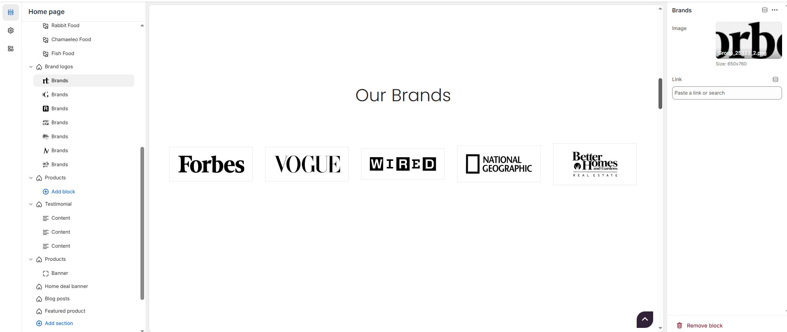

# Brand Logos

The **Brand Logos** section allows you to showcase popular brand logos in a **grid or carousel format**. It enhances credibility and helps customers recognize trusted brands.


* Navigate to **Shopify Admin > Online Store > Themes.**&#x20;
* **Click Customize** on your active theme.&#x20;
* In the Theme Editor, click **Add Section > Brand Logos**


<figure><figcaption></figcaption></figure>

### **Brand Logos Settings & Customization Options**

* **Show Full Width:** Expands the section across the entire screen width.
* **Enable Right & Left Spacing (Works only on Fullwidth):**&#x41;dds spacing on both sides (works only in Full Width mode).
* **Style Value (Padding )** : Adjust the inner spacing above and below the section. Top(px), Bottom(px).
* **Style Value (Margin )** : Adjust the outer spacing above and below the section. Top(px), Bottom(px).
* **Enable Background Image:** Allows adding a background image for the section.
* **Background Image** – Upload the image (Recommended size based on design requirements).
* **Background Style:** Choose background style **( Fixed, Parallax, or None )**.
* **Background Size:** Choose background size **( Auto, Cover, Contain, Repeat)**.
* **Enable Background Color:** Enable a background color (also used as an overlay color).
* **Background Color :** Customize the background color (Set Your Preferred Color).
* **Overlay Transparency:** Adjust the transparency of the overlay (value between 0.01 and 1).
* **Main Heading:** Customize the Main heading.
* **Sub Heading:** Add a short text to the content.
* **Description:** Add text to share information about the collection.
* **Link Text:** Customize the text for the clickable link.
* **Link URL:** Paste a URL or search for an internal link.

### **Section Color Settings**

* **Heading Color:** Customize the heading color (Set Your Preferred Color).
* **Sub Heading Color:** Customize the sub-heading color (Set Your Preferred Color).
* **Description Color:** Customize the description text color (Set Your Preferred Color).
* **Button Background Color:** Customize the button background color (Set Your Preferred Color).
* **Button Text Color:** Customize the button text color (Set Your Preferred Color).
* **Button Hover Background Color:** Customize the hover background color for buttons (Set Your Preferred Color).
* **Button Hover Text Color:** Customize the hover text color for buttons (Set Your Preferred Color).
* **Heading position** : Choose heading positio&#x6E;**( Left, Right, Center )**.

### **Block & Grid Settings**

* **Items per Row:** Choose the number of items displayed per row (1 to 6) ,This will not work, if carousel enabled) .
* **Block Style:** Modify the design if multiple styles are available. Choose the block style **(Style 1, Style 2, Style 3).**&#x20;
* **Enable Box Shadow:** Adds a shadow effect to the banner.
* **Column Gap:** Customizer spacing between columns.
* **Border Radius:** The border corners can be rounded using the block border-radius property. (Leave empty for default border radius).
* **Block  Border Color:** Customize the block border color (Set Your Preferred Color).
* **Block Background Color:** Customize the block background color (Set Your Preferred Color).

### **Carousel Settings (Optional)**

* **Enable Carousel:** Activate sliding effect for brand logos.
* **Enable Auto Height:** Adjust height dynamically based on content.
* **Slides per Row:** Set different values for Desktop, Laptop, Tablet, and Mobile.
* **Autoplay Timing:** Adjust rotation speed (Use 0 to disable autoplay).
* **Enable Carousel Pagination:** Display pagination dots for navigation.
* **Carousel Pagination Alignment:** Choose pagination alignment **(Left Aligned, Center Aligned, Right Aligned)**.
* **Enable Navigation Arrows:** Enable next/previous arrows for navigation.
* **Navigation Arrow Position:** Choose navigation arrow position **(Top left, Top center, Top bottom, Center, Bottom left, Bottom center, Bottom right).**
* **Center navigation alignment** (Select 'Center', in the above dropdown) : Choose the center navigation alignment (Outside container, Along with container,  Inside container ).
* **Navigation Button Background Color:** Customize the background color (Set Your Preferred Color).
* **Navigation Button Icon Color:** Customize the icon color (Set Your Preferred Color).
* **Navigation Button Hover Background Color:** Customize the hover background color (Set Your Preferred Color).
* **Navigation Button Hover Icon Color:** Customize the hover icon color (Set Your Preferred Color).
* **Navigation Dot Color:** Customize the color of navigation dots (Set Your Preferred Color).
* **Navigation Dot Active Color:** Customize the active navigation dot color (Set Your Preferred Color).
* **Enable After Image:** Option to display an additional image after the main brand logos.
* **After Image :** Upload the image (Recommended size based on design requirements).

### **Additional Customizations**

* [**Custom Class:**](https://wdtsupport.gitbook.io/shopify-os/custom-class) The Shopify allows you to apply unique CSS styles to specific sections, blocks, or elements within your theme.

<figure><figcaption></figcaption></figure>

### **Steps to Add a Brand Logo**&#x20;


Without adding block to Brand logo the section seems to be empty


* **Image :** Upload the image (Recommended size based on design requirements).
* **Link :** Add a destination URL (optional) to direct users to the brand's page.
