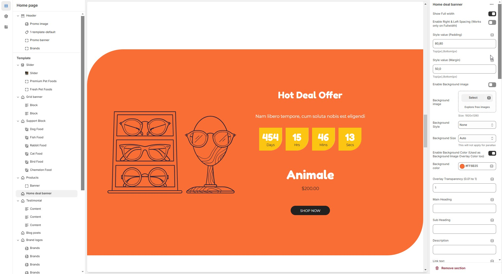

# Deal banner

The **Home Deal Banner** section allows you to highlight exclusive deals with a countdown timer, promotional text, and a call-to-action button.


* Go to **Shopify Admin > Online Store > Themes**.
* Click **Customize** on your active theme.
* In the **Theme Editor**, click **Add Section > Home Deal Banner**.


<figure><figcaption></figcaption></figure>

* **Show Full Width:** Expands the section across the entire screen width.
* **Enable Right & Left Spacing (Works only on Fullwidth):** Adds spacing on both sides (Works only in Full Width mode).
* **Padding (Top, Bottom):** Adjust the inner spacing above and below the section. Top(px), Bottom(px).
* **Margin (Top, Bottom):** Adjust the outer spacing above and below the section. Top(px), Bottom(px).
* **Enable Background Image:** Allows adding a background image for the section.
* **Background Image:** Upload the image (Recommended size based on design requirements).
* **Background Style:** Choose background style **( Fixed, Parallax, or None )**.
* **Background Size:** Choose background size **( Auto, Cover, Contain, Repeat)**.
* **Background Color :** Customize the background color (Set Your Preferred Color).
* **Enable Background Color** **:** Adds an overlay effect to the background.
* **Overlay Transparency:** Adjust the transparency of the overlay (value between 0.01 and 1).
* **Main Heading:** Customize the Main heading.
* **Sub Heading:** Add a short text to the content.
* **Description:** Add text to share information about the collection.
* **Link Text:** Customize the text for the clickable link.
* **Link URL:** Paste a URL or search for an internal link.
* **Heading Position:** Choose heading position **(Left, Center, Right).**

### **Color Settings**

* **Heading Color**: Customize the main heading color (Set Your Preferred Color).
* **Sub Heading Color**: Customize the sub-heading color (Set Your Preferred Color).
* **Description Color**: Customize the description text color (Set Your Preferred Color).
* **Button Background Color**: Customize the button background color (Set Your Preferred Color).
* **Button Text Color**: Customize the button text color (Set Your Preferred Color).
* **Button Hover Background Color**: Customize the hover background color of the button (Set Your Preferred Color).
* **Button Hover Text Color**: Customize the button text color on hover (Set Your Preferred Color).

### **Deals Content Settings**

* **Image**: Upload the image (Recommended size based on design requirements).
* **Show Image**: Toggle to display or hide the deal image.
* **Show Offer**: Toggle to display or hide the offer text.
* **Offer Text**: Enter the promotional offer text (e.g., "Best Offer").
* **Title**: Customize the deal banner title.
* **Sub Title**: Add a short text to the content.
* **Description**: Add text to share information about the deal banner.
* **Deal End Date**: Specify an expiration date (Format: 25 JAN 2025).
* **Deals Timer Radius**: Adjust the border radius for the countdown timer (Set 50% for a rounded timer).
* **Title** : Customize the  title.
* **Price**: Enter the deal price.
* **Show Button Icon**: Enable or disable an icon inside the button.
* **Link Text**: Customize the text for the clickable link.
* **Link URL**: Paste a URL or search for an internal link.
* **Text Alignment**: Choose text alignment (**Left, Center, Right**).

### **Deals Content Color Settings**

* **Title Color**: Customize the deal title color (Set Your Preferred Color).
* **Sub Title Color**: Customize the subtitle color (Set Your Preferred Color).
* **Description Color**: Customize the description text color (Set Your Preferred Color).
* **Price Color**: Customize the price text color (Set Your Preferred Color).
* **Button Background Color**: Customize the button color (Set Your Preferred Color).
* **Button Text Color**: Customize the button text color (Set Your Preferred Color).
* **Button Hover Background Color**: Customize the button background on hover (Set Your Preferred Color).
* **Button Hover Text Color**: Customize the button text color on hover (Set Your Preferred Color).
* **Deals Section Timer BG Color**: Set the background color of the countdown timer (Set Your Preferred Color).
* **Deals Section Timer Number Color**: Customize the number color inside the countdown timer (Set Your Preferred Color).
* **Deals Section Timer Duration Color**: Customize the label color inside the countdown timer (Set Your Preferred Color).

### **Additional Settings**

* [**Custom Class:**](https://wdtsupport.gitbook.io/shopify-os/custom-class) The Shopify allows you to apply unique CSS styles to specific sections, blocks, or elements within your theme.
