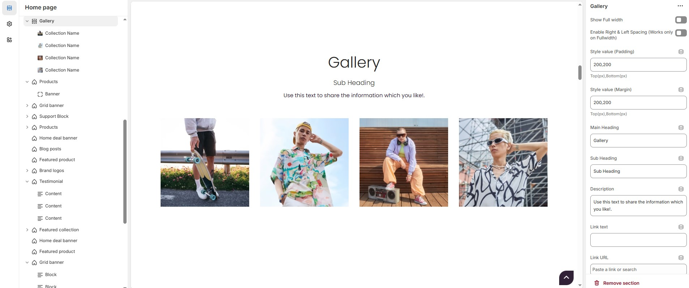
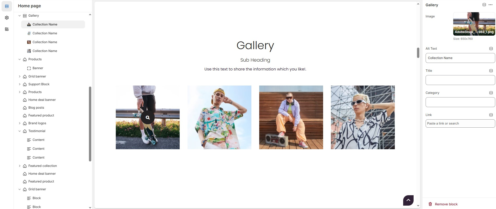

# Gallery Section

The **Gallery Section** in Shopify allows you to display images in a visually appealing format. It's ideal for showcasing products, brand visuals, or customer highlights. You can customize layout, colors, overlays, and add interactive elements for a better user experience.


* Navigate to **Shopify Admin > Online Store > Themes**.
* Click **Customize** on your active theme.
* Select **Add Section > Gallery**.


<figure><figcaption></figcaption></figure>

* **Show Full Width:** Expands the section across the entire screen width.
* **Enable Right & Left Spacing(Works Only on Fullwidth):** Add spacing on both sides (Works only in Full Width mode).
* **Padding (Top, Bottom):** Adjust the inner spacing above and below the section. Top(px), Bottom(px).
* **Margin (Top, Bottom):** Adjust the outer spacing above and below the section. Top(px), Bottom(px).
* **Main Heading:** Customize the Main heading.
* **Sub Heading:** Add a short text to the content.
* **Description:** Add text to share information about the section.
* **Link Text:** Customize the text for the clickable link.
* **Link URL:** Paste a URL or search for an internal link.

### **Section Color Settings**

* **Heading Color**: Customize the heading color (Set Your Preferred Color).
* **Subheading Color**: Customize the subheading color (Set Your Preferred Color).
* **Description Color**: Customize the description text color (Set Your Preferred Color).
* **Button Background Color**: Customize the button background color ( Set Your Preferred Color).
* **Button Text Color**: Customize the button text color (Set Your Preferred Color).
* **Button Hover Background Color**: Customize the button hover background color (Set Your Preferred Color).
* **Button Hover Text Color**: Customize the button text color on hover (Set Your Preferred Color).
* **Use Overlay**: Enable an overlay effect for gallery images.
* **Image Overlay**: Customize the image overlay color (Set Your Preferred Color).
* **Overlay Title**: Customize the overlay title color (Set Your Preferred Color).
* **Overlay Category**: Customize the category text color in overlay (Set Your Preferred Color).
* **Use Overlay Icons**: Display icons over gallery images.
* **Overlay Icon Border Color**: Customize the border color of the overlay icons (Set Your Preferred Color).
* **Overlay Icon Bg1**: Customize the background color of the overlay icons (Set Your Preferred Color).
* **Overlay Icon Text**: Customize the color of the overlay icon text (Set Your Preferred Color).
* **Overlay Icon Hover Background Color**: Customize the background color when hovering over overlay icons (Set Your Preferred Color).
* **Overlay Icon Hover Text**: Customize the text color when hovering over overlay icons (Set Your Preferred Color).
* **Text Hover Background Color**: Customize the background color when hovering over text (Set Your Preferred Color).
* **Text Hover Text Color**: Customize the text color when hovering over text (Set Your Preferred Color).

<figure><figcaption></figcaption></figure>

### **Gallery > Add Gallery**&#x20;

* **Image:** Upload the image (Recommended size based on design requirements).
* **Alt text :** Customize the image alternative text
* **Title :**  Customize the title.
* **Category :** Add text to share information about the gallery.
* **Link :** Paste a URL or search for an internal link.
