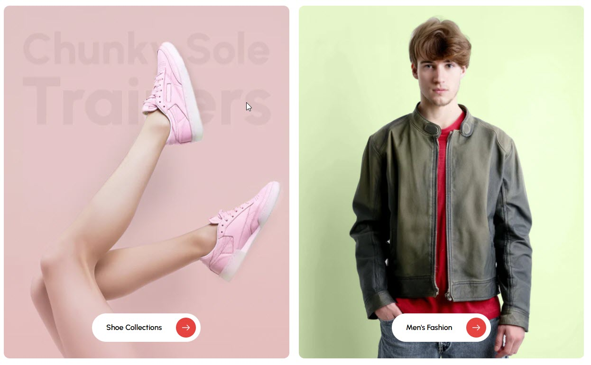

# Grid banner

The **Grid Banner Section** allows you to display multiple banners in a structured grid layout, making it ideal for showcasing promotions, featured categories, or brand messages.


* **Go to** Shopify Admin > **Online Store > Themes**.
* Click **Customize** on your active theme.
* In the Theme Editor, click **Add Section > Grid Banner**.


<figure><figcaption></figcaption></figure>

### Grid banner **& Customization Options**

* **Show Full Width:** Expands the section across the entire screen width.
* **Enable Right & Left Spacing (Works only on Fullwidth):** Adds spacing on both sides (works only in Full Width mode).
* **Style Value (Padding ) :** Adjust the inner spacing above and below the section. Top(px), Bottom(px).
* **Style Value (Margin ) :** Adjust the outer spacing above and below the section. Top(px), Bottom(px).
* **Enable Background Image:** Allows adding a background image for the section.
* **Background Image** : Upload the image (Recommended size based on design requirements).
* **Background Style :** Choose background style **( Fixed, Parallax, or None )**.
* **Background Size :** Choose background size **( Auto, Cover, Contain, Repeat)**.
* **Enable Background Color :** Enable a background color (also used as an overlay color).
* **Overlay Transparency :** Adjust the transparency of the overlay (value between `0.01` and `1`).
* **Main Heading :** Customize the Main heading.
* **Sub Heading :** Add a short text to the content.
* **Description :** Add text to share information about the collection.
* **Link Text :** Customize the text for the clickable link.
* **Link URL :** Paste a URL or search for an internal link.
* **Heading position** : Choose heading positio&#x6E;**( Left, Right, Center )**.

### **Section Color Settings**

* **Heading Color:** Customize the heading color (Set Your Preferred Color).
* **Sub Heading Color:** Customize the sub-heading color (Set Your Preferred Color).
* **Description Color:** Customize the description text color (Set Your Preferred Color).
* **Button Background Color:** Customize the button background color (Set Your Preferred Color).
* **Button Text Color:** Customize the button text color (Set Your Preferred Color).
* **Button Hover Background Color:** Customize the hover background color for buttons (Set Your Preferred Color).
* **Button Hover Text Color:** Customize the hover text color for buttons (Set Your Preferred Color).

### **Display Settings**

* **Banner Style** : Choose banner style **( Grid, List, Overlay ).**
* **Column Gap** : Customize the spacing between banners. Leave empty for default gap in ( px ).
* **Items per Row** : Choose the number of items displayed per row.
* **Grid Border Radius** : Customize banner corner radius.
* **Grid Border Radius** : The border corners can be rounded using the grid border-radius property. (Leave empty for default border radius).
* **Enable Box Shadow** : Adds a shadow effect to banners.
* **Enable Equal Height** : Ensures all banners have the same height (Only for Grid Style).

### **List Style Content Widths**&#x20;

* **Desktop :** Defines how content and image are split (Eg., 50 / 50 ).
* **Laptop (Small Screen) :** Defines the layout for smaller screens.(Eg., 35 / 65 ).
* Mobile resolution defaults to 100/100.

### **Overlay Style Height**

* Customize height based on device.


**Recommended Minimum Heights:** Desktop – 500px | Laptop (small screens)– 450px | Mobile – 350px **(You can set the responsive size as per your needs.)**


### **Advanced Customization**

* [**Custom Class:**](https://wdtsupport.gitbook.io/shopify-os/custom-class) The Shopify allows you to apply unique CSS styles to specific sections, blocks, or elements within your theme.

<figure><figcaption></figcaption></figure>

### **Add Block Customization Options**

* **Image** : Upload the image (Recommended size based on design requirements).
* **Show Image** : Enable/disable the display of the image.
* **Title** :  Customize the Title.
* **Sub Title** :  Add a short text to the content.
* **Description :** Add text to share information about the collection.
* **Link Text** : Customize the text for the clickable link.
* **Link URL** : Paste a URL or search for an internal link.
* **Text Alignment** – Choose text alignment **(** **Left, Center, Right ).**
* **Content Position (Not for Grid Style) :** Choose the position **(Top left, Top center, Top right, Center left, Center, Center right, Bottom left, Bottom center, Bottom right).**
* **Content reverse** : Swap the order of content and image (Only for Grid Style).

### **Block Color Settings**

* **Banner Bg** : Customize the banner background color (Set Your Preferred Color).
* **Content Box Background:** Customize the content box background color (Set Your Preferred Color).
* **Heading Color** : Customize the heading color (Set Your Preferred Color).
* **Subheading Color** : Customize the sub heading color (Set Your Preferred Color).
* **Description Color** : Customize the description color (Set Your Preferred Color).
* **Button Background Color** : Customize the button background color (Set Your Preferred Color).
* **Button Text Color** : Customize the button text color (Set Your Preferred Color).
* **Button Hover Background Color** : Customize the button hover background color (Set Your Preferred Color).
* **Button Hover Text Color** : Customize the button hover text color (Set Your Preferred Color).

### **Overlay Settings**

* **Overlay style :** Choose overlay style **(** **Normal Overlay** or **Gradient Overlay )**.
* **Overlay color :** Customize the Overlay color (Set Your Preferred Color).
* **Overlay opacity** : Adjust the transparency of the overlay (value between 0.01 and 1).
* **Gradient Position (0 to 360) :** Customize the gradient position.only for gradient overlay.
