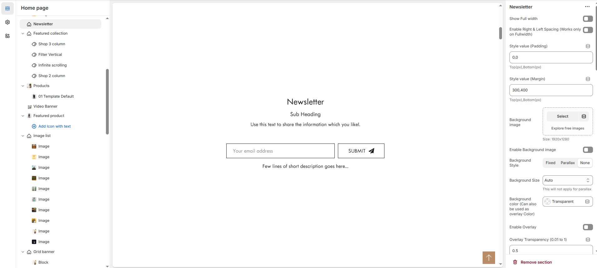

# Newsletter

The **Newsletter** section allows you to collect customer email addresses for updates, promotions, and exclusive content. You can customize the section’s layout, colors, and styles to match your store’s theme.


* **Go to** Shopify Admin > **Online Store > Themes**.
* Click **Customize** on your active theme.
* In the Theme Editor, click **Add Section > Newsletter.**


<figure><figcaption></figcaption></figure>

### **Newsletter Section Settings  & Customization Options**

* **Show Full Width:** Expands the newsletter section across the entire screen width.
* **Enable Right & Left Spacing (Works only on Fullwidth):** Adds spacing on both sides (Works only in Full Width mode).
* **Style Value (Padding ) :** Adjust the inner spacing above and below the section. Top(px), Bottom(px).
* **Style Value (Margin ) :** Adjust the outer spacing above and below the section. Top(px), Bottom(px).
* **Enable Background Image:** Allows adding a background image for the section.
* **Upload Image:** Upload the image (Recommended size based on design requirements).
* **Background Style:** Choose background style **( Fixed, Parallax, or None )**.
* **Background Size:** Choose background size **( Auto, Cover, Contain, Repeat)**.
* **Background Color :** Customize the background color (Set Your Preferred Color).
* **Enable Overlay:** Adds an overlay effect to the background.
* **Overlay Transparency:** Adjust the transparency of the overlay (value between 0.01 and 1).
* **Main Heading:** Customize the Main heading.
* **Sub Heading:** Add a short text to the content.
* **Description:** Add text to share information about the collection.
* **Link Text:** Customize the text for the clickable link.
* **Link URL:** Paste a URL or search for an internal link.

### **Section Color Settings**

* **Heading Color:** Customize the heading color (Set Your Preferred Color).
* **Subheading Color:** Customize the subheading color (Set Your Preferred Color).
* **Description Color:** Customize the description text color (Set Your Preferred Color).
* **Button Background Color:** Customize the button background color (Set Your Preferred Color).
* **Button Text Color:** Customize the button text color (Set Your Preferred Color).
* **Button Hover Background Color:** Customize the hover background color for buttons (Set Your Preferred Color).
* **Button Hover Text Color:** Customize the hover text color for buttons (Set Your Preferred Color).
* **Heading Position :** Choose Heading Position alignment (**Left, Center, Right**).

### **Form Settings**

* **Content Position :** Choose Content Position alignment (**Left, Center, Right**).
* **Form Width (in %) :** Adjust the width (Adjustable as per design needs).
* **Newsletter Description:** Customizer the Newsletter description.
* **Newsletter Style:** Modify if multiple styles are available.
* **Swap Button Text & Icon Position:** Enable the placement of text and icon.
* **Gap Between Text Box & Button (in px):**  Customizer spacing (Eg., 10px) (Not applicable for Style 3 & 4) .

### **Newsletter Color Settings**

* **Box Border Color:** Customize the border color (Set Your Preferred Color).
* **Box Background Color:** Customize the background color (Set Your Preferred Color).
* **Box Border Color (On Focus/Active):** Customize the active border color (Set Your Preferred Color).
* **Button Background Color (Leave empty for Style 4):** Customize the button background color (Set Your Preferred Color).
* **Button Text Color:** Customize the button text color (Set Your Preferred Color).
* **Button Hover Background Color (Leave empty for Style 4):** Customize the hover background color (Set Your Preferred Color).
* **Button Hover Text Color:** Customize the hover text color (Set Your Preferred Color).
* **Newsletter Description Color:** Customize the description text color (Set Your Preferred Color).

### **Advanced Customization**

* [**Custom Class :** ](../custom-class.md)The Shopify allows you to apply unique CSS styles to specific sections, blocks, or elements within your theme.
