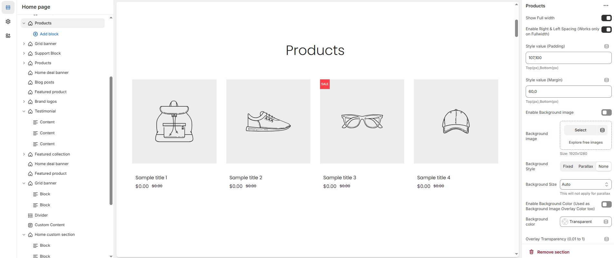
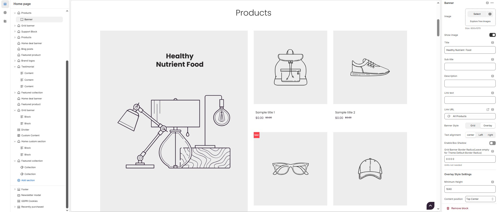

# Products&#x20;

The **Products Section** allows you to highlight your **best-selling** or **featured products** in a flexible and customizable layout. With options for **carousel display, list view, and design customizations**, you can tailor the section to match your store’s style and enhance the shopping experience.


* Navigate to **Shopify Admin > Online Store > Themes**.
* **Click** Customize on your active theme.
* **In the Theme Editor**, click **Add Section > Products**


<figure><figcaption></figcaption></figure>

### **Products Section & Customization Options**

* **Show Full Width:** Expands the section across the entire screen width.
* **Enable Right & Left Spacing (Works only on Fullwidth):** Adds spacing on both sides (Works only in Full Width mode).
* **Style Value (Padding ) :** Adjust the inner spacing above and below the section. Top(px), Bottom(px).
* **Style Value (Margin ) :** Adjust the outer spacing above and below the section. Top(px), Bottom(px).
* **Enable Background Image:** Allows adding a background image for the section.
* **Background Image:** Upload the image (Recommended size based on design requirements).
* **Background Style:** Choose background style **( Fixed, Parallax, or None )**.
* **Background Size:** Choose background size **( Auto, Cover, Contain, Repeat)**.
* **Background Color :** Customize the background color (Set Your Preferred Color).
* **Enable Overlay:** Adds an overlay effect to the background.
* **Overlay Transparency:** Adjust the transparency of the overlay (value between 0.01 and 1).
* **Main Heading:** Customize the Main heading.
* **Sub Heading:** Add a short text to the content.
* **Description:** Add text to share information about the collection.
* **Link Text:** Customize the text for the clickable link.
* **Link URL:** Paste a URL or search for an internal link.

### **Section Color Settings**

* **Heading Icon Color:** Customize the heading icon color (Set Your Preferred Color).
* **Heading Color**: Customize the main heading color (Set Your Preferred Color).
* **Sub Heading Color**: Customize the sub-heading color (Set Your Preferred Color).
* **Description Color**: Customize the description text color (Set Your Preferred Color).
* **Button Background Color**: Customize the button background color (Set Your Preferred Color).
* **Button Text Color**: Customize the button text color (Set Your Preferred Color).
* **Button Hover Background Color**: Customize the hover background color of the button (Set Your Preferred Color).
* **Button Hover Text Color**: Customize the button text color on hover (Set Your Preferred Color).
* **Heading Position:** Choose the heading position **(Center, Left, Right).**

### &#x20;**Grouped Content Settings**

* **Grouped Content Background Color:** Customize the grouped content background color (Set Your Preferred Color).
* **Grouped Content Column Gap:** Customizer spacing between columns.
* **Grouped Content Overall Padding:** Adjust spacing above and below the section.
* **Group Border Radius :** The border corners can be rounded using the content border-radius property. (Leave empty for default border radius).
* **Enable Group Box Shadow:** Add a shadow effect.
* **Content Reverse:** Enable to swap the row order.

### **Grouped Content Width**

* **Desktop :** Defines how content and image are split (Eg., 30 / 70).
* **Laptop :** Defines the layout for smaller screens (Eg., 35/ 65).
* Mobile resolution defaults to 100/100.

### **Additional Content Settings (Add a block from top)**

* **Additional content bg color :** Customize the additional content background color (Set Your Preferred Color).
* **Additional content box shadow :** Add a shadow effect.
* **Additional Content Overall Padding :** Adjust spacing above and below the section.
* **Additional Content Border radius :** The border corners can be rounded using the additional content border-radius property. (Leave empty for default border radius).

### **Main Content Settings**

* **Enable Main content :** display the main content.
* **Main content Bg color:** Customize the main content background color (Set Your Preferred Color).
* **Main content Box shadow:** Add a shadow effect.
* **Main content Radius:** The border corners can be rounded using the main content border-radius property. (Leave empty for default border radius).
* **Main Content Overall Padding :** Adjust spacing above and below the section.
* **Collection:** Choose a product collection.
* **Collection Column Gap:** Customizer spacing between columns.
* **Collection Border Radius:** The border corners can be rounded using the collection border-radius property. (Leave empty for default border radius).
* **Enable List View:** Display products in a list format (not compatible with carousel).
* **Items Per Row:** Choose the number of items displayed per row.
* **Number of Products to Display:** Customize the total number of products shown.
* **Enable Carousel:** Activate a sliding product display.
* **Slides Per Row:** Set different values for Desktop, Laptop, Tablet, and Mobile.
* **Number of Rows:** Customize the number of rows.
* **Autoplay Timing:** Define auto-slide timing (Use `0` to disable autoplay).
* **Enable Auto Height:** Adjust height dynamically based on content.
* **Enable Carousel Pagination:** Display pagination dots for navigation.
* **Pagination Alignment:** Choose pagination alignment **(Left Aligned, Center Aligned, Right Aligned)**.
* **Pagination Position:** Choose pagination position **( Inside the element or outside the element )**.
* **Enable Navigation Arrows:** Enable next/previous arrows for navigation.
* **Navigation Arrow Position:** Choose navigation arrow position **(Top left, Top center, Top bottom, Center, Bottom left, Bottom center, Bottom right).**
* **Center Navigation Alignment:** Choose navigation arrow alignment **(Along with container, Inside container and Outside container)**.
* **Navigation Button Background Color:** Customize the background color for navigation (Set Your Preferred Color).
* **Navigation Button Icon Color:** Customize the icon color for navigation (Set Your Preferred Color).
* **Navigation Button Hover Background Color:** Customize the hover background color for navigation (Set Your Preferred Color).
* **Navigation Button Hover Icon Color:** Customize the hover icon color for navigation (Set Your Preferred Color).
* **Navigation Dot Color:** Customize the color of navigation dots (Set Your Preferred Color).
* **Navigation Dot Active Color:** Customize the active navigation dot color (Set Your Preferred Color).

### **Additional Customizations**

* [**Custom Class:**](https://wdtsupport.gitbook.io/shopify-os/custom-class) The Shopify allows you to apply unique CSS styles to specific sections, blocks, or elements within your theme.

<figure><figcaption></figcaption></figure>

### **Products Section > Add Banner**

The **Banner** feature allows you to highlight special promotions, discounts, or featured products with an image and customizable text elements.

### **Banner**&#x20;

* **Image:** Upload the image (Recommended size based on design requirements).
* **Show Image:** Allows adding a image for the section.
* **Title:** Customize the title.
* **Subheading:** Add a short text to the content.
* **Description:** Add text to share information about the banner.
* **Link Text:** Customize the text for the clickable link.
* **Link URL:** Paste a URL or search for an internal link.
* **Banner Style:** Choose the display style **( Grid or overlay ).**
* **Text Alignment:** Choose the text alignment **( Left, Center, or Right )**.
* **Enable Box Shadow:** Adds a shadow effect to banner.
* **Grid Banner Border Radius:** The border corners can be rounded using the grid banner border-radius property. (Leave empty for default border radius).

#### **Overlay Style Settings**

* **Minimum Height:** Adjust the height.
* **Content Position:** Choose content position **(Top left, Top center, Top right, Center left, Center, Center right, Bottom left, Bottom center, Bottom right).**

#### **Grid Banner Color Settings**

* **Heading Color:** Customize the heading color (Set Your Preferred Color).
* **Sub Heading Color:** Customize the sub-heading color (Set Your Preferred Color).
* **Description Color:** Customize the description text color (Set Your Preferred Color).
* **Button Background Color:** Customize the button background color (Set Your Preferred Color).
* **Button Text Color:** Customize the button text color (Set Your Preferred Color).
* **Button Hover Background Color:** Customize the hover background color for buttons (Set Your Preferred Color).
* **Button Hover Text Color:** Customize the hover text color for buttons (Set Your Preferred Color).
* **Background Color:** Customize the background color (Set Your Preferred Color).
* **Image Overlay Style :** Choose overlay style **(** **Normal Overlay** or **Gradient Overlay )**.
* **Image Overlay Color :** Customize the Overlay color (Set Your Preferred Color).
* **Image Overlay Opacity** : Adjust the transparency of the overlay (value between 0.01 and 1).
* **Image Overlay Gradient Position (0 to 360) :** Customizer the gradient position.

### **Menu**

* **Title:** Customize the title.
* **Choose the menu :** Select the menu.

#### **Color Settings**

* **Block Heading Color:** Customize the block heading color (Set Your Preferred Color).
* **Block Link Color:** Customize the block link color (Set Your Preferred Color).
* **Block Link Hover Color :**  Customize the block link hover color (Set Your Preferred Color).

### **Product**

* **Select product :** Choose the product.

### **Collection**

* **Title :** Customize the title.
* **Select Collection:** Select the collection.
* **Enable Box shadow:** Add a shadow effect.
* **Collection Border Radius:** The border corners can be rounded using the collection border-radius property (Leave empty for default border radius).
* **Collection Column Gap:** Customizer spacing between columns.
* **Limit (Will not work if carousel is enabled) :** Customize the collection limit (eg., 1 to 5).

#### **Carousel Settings**

* **Enable Carousel :** Activate a sliding product display.
* **Slide per row \[Desktop, Laptop, Tablet, Mobile] :**  Choose the number of items displayed per row.
* **Number of Rows :** Customize the number of rows.
* **Autoplay timing :** Define auto-slide timing (Use 0 to disable autoplay).
* **Enable Auto Height :** Adjust height dynamically based on content.
* **Enable Carousel Pagination :** Display pagination dots for navigation.
* **Carousel Pagination Alignment (Only Bottom) :** Choose pagination alignment **(Left Aligned, Center Aligned, Right Aligned)**.
* **Enable Navigation Arrows :** Enable next/previous arrows for navigation.
* **Navigation Arrows position :** Choose navigation arrow position **(Top left, Top center, Top bottom, Center, Bottom left, Bottom center, Bottom right).**
* **Navigation Button BG Color :** Customize the background color for navigation (Set Your Preferred Color).
* **Navigation Button Icon Color :**  Customize the icon color for navigation (Set Your Preferred Color).&#x20;
* **Navigation Button Hover BG Color :** Customize the hover background color for navigation (Set Your Preferred Color).
* **Navigation Button Hover Icon Color :** Customize the hover icon color for navigation (Set Your Preferred Color).
* **Navigation Dot Color :** Customize the color of navigation dots (Set Your Preferred Color).
* **Navigation Dot Active Color :** Customize the active navigation dot color (Set Your Preferred Color).

### **Timer**&#x20;

* **Deal end date :** Specify an expiration date (Format: 25 JAN 2025).
* **Image :** Upload the image (Recommended size based on design requirements).
* **Show Image :** Toggle to display or hide the deal image.
* **Title :**  Customize the title.
* **Sub title :** Add a short text to the content.
* **Description :** Add text to share information about the collection.
* **Link Text :** Customize the text for the clickable link.
* **Link URL :** Paste a URL or search for an internal link.
* **Text alignment :** Choose text alignment (**Left, Center, Right**).

#### **Deal Color Settings**&#x20;

* **Banner Bg :** Customize the banner background (Set Your Preferred Color)
* **Heading Color :** Customize the heading color (Set Your Preferred Color).
* **Sub Heading Color :** Customize the sub-heading color (Set Your Preferred Color).
* **Description Color :** Customize the description text color (Set Your Preferred Color).
* **Button Bg Color :** Customize the button background color (Set Your Preferred Color).
* **Button Text Color :** Customize the button text color (Set Your Preferred Color).
* **Button Hover Bg Color :** Customize the hover background color of the button (Set Your Preferred Color).
* **Button Hover Text Color :** Customize the button text color on hover (Set Your Preferred Color).
* **Deals Section Bg Color :** Customize the background color of the deal section (Set Your Preferred Color).
* **Deals Section Timer Bg color:**  Customize the deal section timer background color (Set Your Preferred Color).
* **Deals Section Timer Color:** Customize the deal section timer color (Set Your Preferred Color).

