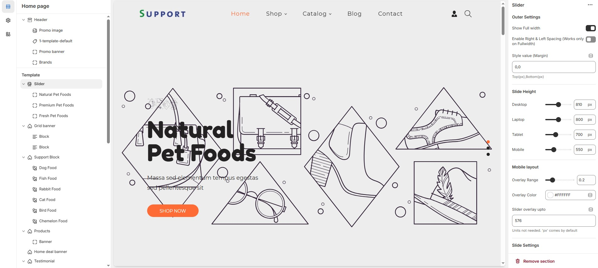
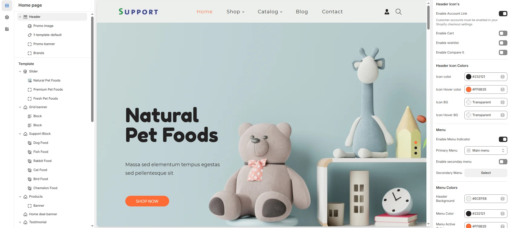
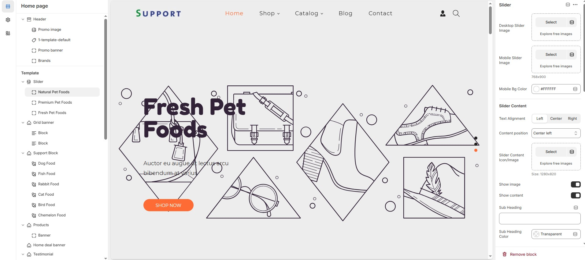

# Slider

The **Slideshow Section** allows you to display multiple images or banners in a rotating format, making it ideal for highlighting promotions, featured products, or key brand messages.


* Go to **Shopify Admin > Online Store > Themes.**
* **Click** Customize on your live theme.
* In the theme editor, **Click** **Add Section > Slider**.


<figure><figcaption></figcaption></figure>

### **Outer Settings**

* **Show Full Width:** Expands the slider across the entire screen width.
* **Enable Right & Left Spacing (Works only on Fullwidth):** Adds spacing on both sides (Works only in Full Width mode).
* **Style Value (Margin ) :** Adjust the outer spacing above and below the section. Top(px), Bottom(px).

**Slide Height (Responsive Settings):** Customize height based on device


&#x20;**Recommended Slide Heights:** Desktop – 810px | Laptop – 800px | Tablet – 700px | Mobile – 550px **(You can set the responsive size as per your needs.)**


### **Mobile Layout Settings**

* **Overlay Range:** Adjust the transparency of the overlay (value between `0.01` and `1`).
* **Overlay Color:** Customize the overlay color (Set Your Preferred Color).
* **Slider Overlay Up To:** Customize slider overly as per your requirements  (Defult:`576px` Applies overlay up to this width).

### **Slide Settings**

* **Content Within Container:** Ensures the content stays inside a container for better alignment.
* **Overall Border Radius:** The border corners can be rounded using the Overall border-radius property. (Leave empty for default border radius).
* **Content Border Radius:** The border corners can be rounded using the Content border-radius property. (Leave empty for default border radius). unit not needed.
* **Enable Autoplay Slides:** Enables automatic slide rotation.
* **Change Slides Every:** Choose slides seconds **(5sec, 6sec, 7sec, 8sec, 9sec and 10 sec)**. Enable autoplay slider before selecting.

### **Pagination & Navigation**

* **Enable Pagination Dots:** Enable pagination dots for slide transitions.
* **Carousel Pagination Dots Alignment (Only Bottom):** Choose pagination alignments **(Right alignment, Left alignment, Center alignment).**
* **Carousel Pagination Dots Bottom Alignment:** Choose pagination dot alignments **(Inside the element, Outside the element).**
* **Enable Navigation Arrows:** Enable previous/next arrows for navigation.
* **Navigation Arrows Position:** Choose navigation arrow position **(Top left, Top center, Top bottom, Center, Bottom left, Bottom center, Bottom right).**
* **Navigation Arrows Inside Container:** Choose navigation arrow position **(Along with container, Inside container and Outside container)**.

### **Navigation Dots & Arrows Color Settings**

* **Navigation Arrow Background Color:** Customize the background color for navigation arrows (Set Your Preferred Color).
* **Navigation Arrow Icon Color:** Customize the icon color for navigation arrows (Set Your Preferred Color).
* **Navigation Arrow Hover Background Color:** Customize the hover background color for navigation arrows (Set Your Preferred Color).
* **Navigation Arrow Hover Icon Color:** Customize the hover icon color for navigation arrows (Set Your Preferred Color).
* **Navigation Dot Color:** Customize the color of navigation dots (Set Your Preferred Color).
* **Navigation Dot Active Color:** Customize the active navigation dot color (Set Your Preferred Color).

### **Image Settings**

* **Enable Image:** Allows adding a bottom image.
* **Bottom Image:** Upload the image (Recommended size based on design re&#x71;_&#x75;irements)_.

### **Advanced Customization**

* [**Custom Class:**](../custom-class.md) The Shopify allows you to apply unique CSS styles to specific sections, blocks, or elements within your theme.

<figure><figcaption></figcaption></figure>


Adding a **block** will display the **image and content.** Without the block, the slideshow remains empty.Can also remove and add block as per the theme requirement.


* **Desktop slider image :** Upload the main slideshow image to view in desktop.
* **Mobile slider image :** Upload a that to be view in mobile version.
* **Mobile Bg color:** Customize the mobile background color (Set Your Preferred Color).

### **Slider Content**

* **Text Alignment :** Choose text alignment **(Left, Right, Center)**.
* **Content position:** Choose the position **(Top left, Top center, Top right, Center left, Center, Center right, Bottom left, Bottom center, Bottom right).**
* **Slider content icon / image:** Upload the custom image (Recommended size based on design requirements).
* **Show image :**  Displays an image as the slider content image.
* **Show content :** Displays an content as the slider content.
* **Sub heading :** Add a short text to the content.
* **Sub heading color :** Customize the sub heading color (Set Your Preferred Color).
* **Sub heading text size :** Customizer the Sub heading font size.
* **Heading :** Adding title to the content on slideshow block.
* **Heading color :** Customize the heading color (Set Your Preferred Color).
* **Heading font size :** Customizer the heading font size.
* **Description :** Add a description or supporting text.
* **Description color :** Customize the description color (Set Your Preferred Color).
* **Description text size :**  Customizer the description font size.
* **Slider button :** Set the text of action clickable
* **Slider link :**  Add a destination URL.
* **Button bg color :**  Customize the button background color (Set Your Preferred Color).
* **Button text color :**  Customize the button text color (Set Your Preferred Color).
* **Button hover bg color :**  Customize the button hover background color (Set Your Preferred Color).
* **Button hover text color :**  Customize the button hover text color (Set Your Preferred Color).
* **Slider button 2 :** Set the text of action clickable
* **Slider 2 link :**  Add a destination URL.
* **Button 2 bg color :**  Customize the button background color (Set Your Preferred Color).
* **Button 2 text color :**  Customize the button text color (Set Your Preferred Color).
* **Button 2 hover bg color :**  Customize the button hover background color (Set Your Preferred Color).
* **Button 2 hover text color :**  Customize the button hover text color (Set Your Preferred Color).
* **Slide Content Bg Color :**   Customize the slider content background color (Set Your Preferred Color).

<figure><figcaption></figcaption></figure>

