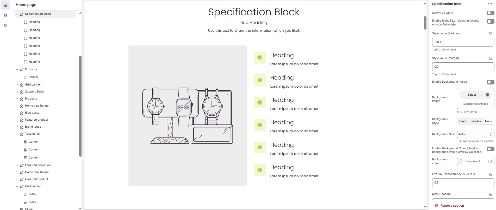
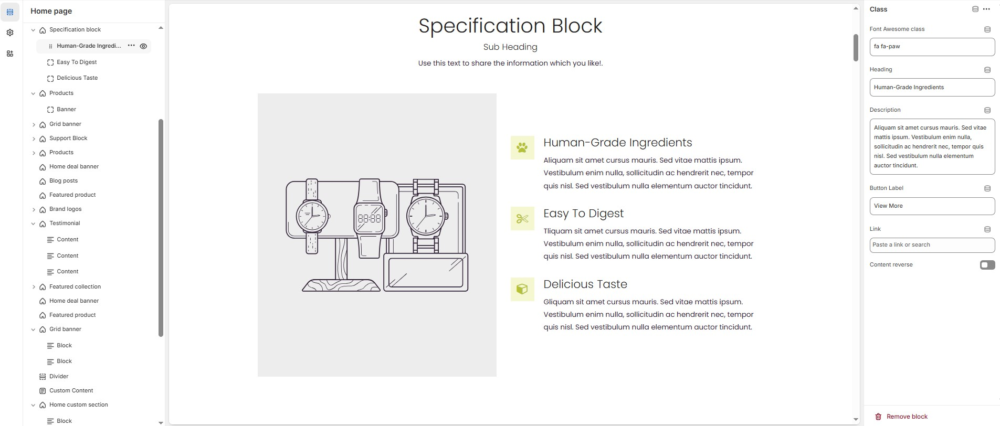

# Specification Block

The **Specification Block** section allows you to display key product or service features in a structured layout with customizable text, images, and design options.


* Go to **Shopify Admin > Online Store > Themes**.
* Click **Customize** on your active theme.
* In the **Theme Editor**, click **Add Section > Specification Block**.


<figure><figcaption></figcaption></figure>

### **Specification Block Settings & Customization Options**

* **Show Full Width:** Expands the section across the entire screen width.
* **Enable Right & Left Spacing (Works only on Fullwidth):** Adds spacing on both sides (Works only in Full Width mode).
* **Padding (Top, Bottom):** Adjust the inner spacing above and below the section. Top(px), Bottom(px).
* **Margin (Top, Bottom):** Adjust the outer spacing above and below the section. Top(px), Bottom(px).
* **Enable Background Image:** Allows adding a background image for the section.
* **Background Image:** Upload the image (Recommended size based on design requirements).
* **Background Style:** Choose background style **( Fixed, Parallax, or None )**.
* **Background Size:** Choose background size **( Auto, Cover, Contain, Repeat)**.
* **Background Color :** Customize the background color (Set Your Preferred Color).
* **Enable Overlay:** Adds an overlay effect to the background.
* **Overlay Transparency:** Adjust the transparency of the overlay (value between 0.01 and 1).
* **Main Heading:** Customize the Main heading.
* **Sub Heading:** Add a short text to the content.
* **Description:** Add text to share information about the collection.
* **Link Text:** Customize the text for the clickable link.
* **Link URL:** Paste a URL or search for an internal link.

### **Section Color Settings**

* **Heading Color**: Customize the main heading color (Set Your Preferred Color).
* **Sub Heading Color**: Customize the sub-heading color (Set Your Preferred Color).
* **Description Color**: Customize the description text color (Set Your Preferred Color).
* **Button Background Color**: Customize the button background color (Set Your Preferred Color).
* **Button Text Color**: Customize the button text color (Set Your Preferred Color).
* **Button Hover Background Color**: Customize the hover background color of the button (Set Your Preferred Color).
* **Button Hover Text Color**: Customize the button text color on hover (Set Your Preferred Color).

### **Display Settings**

* **Column Gap**: Customizer spacing between columns.
* **Vertical Position**: Choose the vertical position **( Vertical top, Vertical center or Vertical bottom)**.

### **Column Width Settings**

* **Desktop:** Defines how content and image are split (Eg., 50 / 50).
* **Laptop:** Defines how content and image are split (Eg., 40/ 60).
* **Tablet**: Defines the layout for smaller screens(Eg., 35/ 65).

### **Main Block Settings**

* **Enable Image**: Allows adding a image for the section.
* **Image**: Upload the image (Recommended size based on design requirements).
* **Title**: Customize the main block title.
* **Sub Title**: Add a short text to the content.
* **Description**: Add text to share information about the section.
* **Link Text:** Customize the text for the clickable link.
* **Link URL:** Paste a URL or search for an internal link.
* **Banner Style:** Choose the banner style **(Grid or Overlay).**
* **Text Alignment**: Choose text alignment **( Center, Left, Right ).**
* **Banner Content Position**: Choose the banner content postion **(Top left, Top center, Top bottom, Center left, Center, Center right, Bottom left, Bottom center, Bottom right).**
* **Minimum Height (Overlay Style Only)**: Adjust the height.
* **Banner Border Radius**: The border corners can be rounded using the banner border-radius property. (Leave empty for default border radius).
* **Enable Box Shadow**: Add a shadow effect.
* **Overlay style :** Choose overlay style **(** **Normal Overlay** or **Gradient Overlay )**.
* **Overlay color :** Customize the Overlay color (Set Your Preferred Color).
* **Overlay opacity** : Adjust the transparency of the overlay (value between 0.01 and 1).
* **Gradient Position (0 to 360) :** Customizer the gradient position.

### **Main Block Color Settings**

* **Banner Bg** : Customize the banner background color (Set Your Preferred Color).
* **Heading Color** : Customize the heading color (Set Your Preferred Color).
* **Subheading Color** : Customize the sub heading color (Set Your Preferred Color).
* **Description Color** : Customize the description color (Set Your Preferred Color).
* **Button Background Color** : Customize the button background color (Set Your Preferred Color).
* **Button Text Color** : Customize the button text color (Set Your Preferred Color).
* **Button Hover Background Color** : Customize the button hover background color (Set Your Preferred Color).
* **Button Hover Text Color** : Customize the button hover text color (Set Your Preferred Color)

### **Additional Block Settings**

* **Block Style**: Modify if multiple styles are available.
* **Icon/Image Size**: Customize the icon or image size (e.g., 24px).
* **Icon/Image Border Radius**: The border corners can be rounded using the icon/image border-radius property. (Leave empty for default border radius).
* **Layout Style**: Modify if multiple styles are available.

### **Settings for Block Style 1**&#x20;

* **Icon/Image Outer Size**: Adjust the outer size of the icon/image (e.g., 50px).

### **Settings for Layout Style 3**

* **Main Heading**: Customize the main heading.
* **Subheading**: Add a short text to the content.
* **Description**: Add text to share information about the block.
* **Heading Position**: Choose heading position **( Left, Center, Right ).**

### **Block Color Settings**

* **Icon Background Color**: Customize the icon background color ( Set Your Preferred Color ).
* **Icon Color**: Customize the icon color ( Set Your Preferred Color ).
* **Heading Color**: Customize the heading text color ( Set Your Preferred Color ).
* **Description Color**: Customize the description text color ( Set Your Preferred Color ).
* **Button Background Color**: Customize the button background color ( Set Your Preferred Color ).
* **Button Text Color**: Customize the button text color ( Set Your Preferred Color ).
* **Button Hover Background Color**: Customize the button hover background color ( Set Your Preferred Color ).
* **Button Hover Text Color**: Customize the button hover text color ( Set Your Preferred Color ).

### **Advanced Customization**

* [**Custom Class:**](https://wdtsupport.gitbook.io/shopify-os/custom-class) The Shopify allows you to apply unique CSS styles to specific sections, blocks, or elements within your theme.

<figure><figcaption></figcaption></figure>

### **Steps to Add a Icon or Class**

* **Class/Icon:**&#x4F;n default the specification block add class, There are two types of block **Class** and **Icon,**&#x54;he class allows to add font awesome class, The icon allows to add image or svg options. &#x20;
* **Font awesome class:** Customize the font awesome icon.
* **Heading:** Customize the heading.
* **Description:** Add text to share information about the section.
* **Button label:** Customize the text for the clickable link.
* **Link:** Paste a URL or search for an internal link.
* **Content Reverse:** Enable to **swap the row order** of icon and text in specification block.
