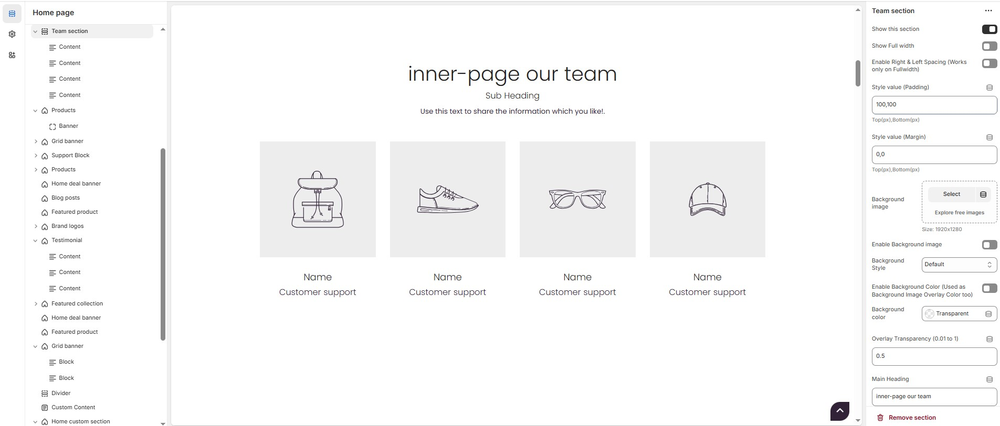
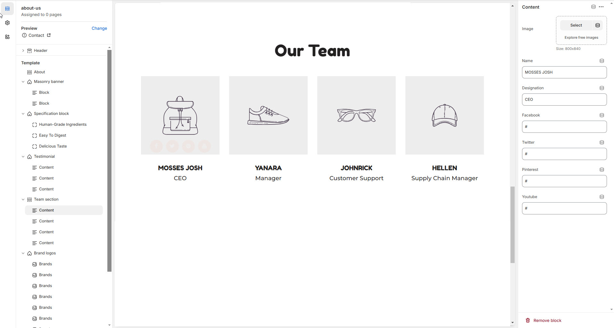

# Team Section

A **Team Section** in Shopify allows you to showcase the members of your team, adding a personal touch to your store and building trust with customers. This section typically includes photos, names, job titles, and brief bios of your team members.


* **Go to** Shopify Admin > **Online Store > Themes**.
* Click **Customize** on your active theme.
* In the Theme Editor, click **Add Section > Team Section**.


<figure><figcaption></figcaption></figure>

### **Team Section Settings & Customization Options**

* **Show this Section:** Allows adding a sections.&#x20;
* **Show Full Width:** Expands the section across the entire screen width.
* **Enable Right & Left Spacing (Works only on Fullwidth):** Adds spacing on both sides (Works only in Full Width mode).
* **Padding (Top, Bottom):** Adjust the inner spacing above and below the section. Top(px), Bottom(px).
* **Margin (Top, Bottom):** Adjust the outer spacing above and below the section. Top(px), Bottom(px).
* **Background Image:** Upload the image (Recommended size based on design requirements).
* **Enable Background Image:** Allows adding a background image for the section.
* **Background Style:** Choose background style **( Fixed, Parallax, or None )**.
* **Background Size:** Choose background size **( Auto, Cover, Contain, Repeat)**.
* **Enable Background Color(Used as Background Image Overlay Color too) :** Allow to enable the background color.
* **Background Color :** Customize the background color (Set Your Preferred Color).
* **Enable Overlay:** Adds an overlay effect to the background.
* **Overlay Transparency:** Adjust the transparency of the overlay (value between 0.01 and 1).
* **Main Heading:** Customize the Main heading.
* **Sub Heading:** Add a short text to the content.
* **Description:** Add text to share information about the collection.
* **Link Text:** Customize the text for the clickable link.
* **Link URL:** Paste a URL or search for an internal link.

### **Section Color Settings**

* **Heading Color**: Customize the main heading color (Set Your Preferred Color).
* **Sub Heading Color**: Customize the sub-heading color (Set Your Preferred Color).
* **Description Color**: Customize the description text color (Set Your Preferred Color).
* **Button Background Color**: Customize the button background color (Set Your Preferred Color).
* **Button Text Color**: Customize the button text color (Set Your Preferred Color).
* **Button Hover Background Color**: Customize the hover background color of the button (Set Your Preferred Color).
* **Button Hover Text Color**: Customize the button text color on hover (Set Your Preferred Color).

### **Block Settings**

* **Items Per Row**: Choose the number of items displayed per row .

### **Block Color Settings**

* **Heading Color**: Customize the heading color (Set Your Preferred Color).
* **Description Color**: Customize the description color (Set Your Preferred Color).
* **Image Overlay Background Color**: Customize the image overlay color (Set Your Preferred Color).
* **Social Icon Background Color**: Customize the background color of social media icons (Set Your Preferred Color).
* **Social Icon Color**: Customize the color of the social media icons (Set Your Preferred Color).
* **Social Icon Background Hover Color**: Customize the background color on hover (Set Your Preferred Color).
* **Social Icon Hover Color**: Customize the social icon color on hover (Set Your Preferred Color).

### **Add Content > Team Member**


Without adding block to Team section the section seems to be empty


Each team member's profile includes the following fields:

* **Image** – Upload the image (Recommended size based on design requirements).
* **Name** – Enter the team member’s name (e.g., "MOSSES JOSH").
* **Designation** – Customize the job title (e.g., "CEO").
* **Twitter:** Add a profile link (**e.g.,** [**https://twitter.com/shopify**](https://twitter.com/shopify)).
* **Facebook:** Add a profile link (**e.g.,** [**https://facebook.com/shopify**](https://facebook.com/shopify)).
* **Pinterest:** Add a profile link (**e.g.,** [**https://pinterest.com/shopify**](https://pinterest.com/shopify)).
* **Instagram:** Add a profile link (**e.g.,** [**https://instagram.com/shopify**](https://instagram.com/shopify)).
* **YouTube:** Add a profile link (**e.g.,** [**https://youtube.com/shopify**](https://youtube.com/shopify)).

<figure><figcaption></figcaption></figure>
