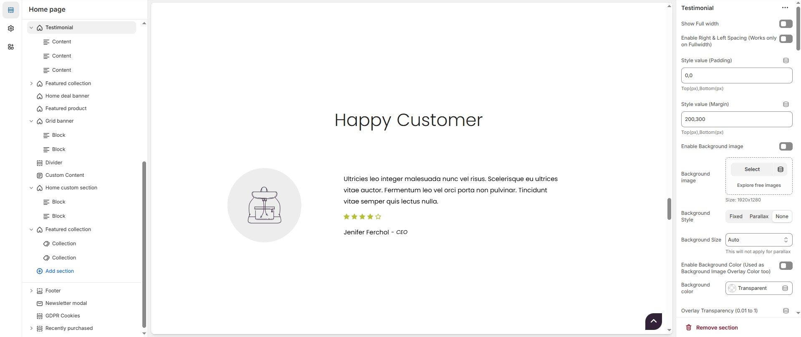
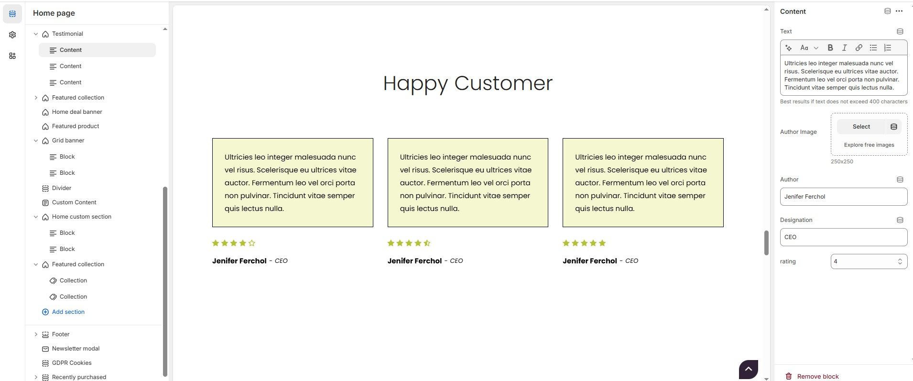

# Testimonial

The **Testimonial Section** allows you to showcase customer feedback in an engaging and structured format. This section includes images, quotes, author details, and multiple styling options to enhance credibility and trust.


* **Go to Shopify Admin > Online Store > Themes.**
* Click **Customize on your a**ctive theme.
* **In the Theme Editor,** click **Add Section** > **Testimonial.**


<figure><figcaption></figcaption></figure>

### **Testimonial Section Settings & Customization Options**

* **Show Full Width:** Expands the section across the entire screen width.
* **Enable Right & Left Spacing (Works only on Fullwidth):** Adds spacing on both sides (Works only in Full Width mode).
* **Padding (Top, Bottom):** Adjust the inner spacing above and below the section. Top(px), Bottom(px).
* **Margin (Top, Bottom):** Adjust the outer spacing above and below the section. Top(px), Bottom(px).
* **Enable Background Image:** Allows adding a background image for the section.
* **Background Image:** Upload the image (Recommended size based on design requirements).
* **Background Style:** Choose background style **( Fixed, Parallax, or None )**.
* **Background Size:** Choose background size **( Auto, Cover, Contain, Repeat)**.
* **Enable Background Color(Used as Background Image Overlay Color too) :** Allows adding a background color for the sections on enable.
* **Background Color :** Customize the background color (Set Your Preferred Color).
* **Overlay Transparency:** Adjust the transparency of the overlay (value between 0.01 and 1).
* **Main Heading:** Customize the Main heading.
* **Sub Heading:** Add a short text to the content.
* **Description:** Add text to share information about the collection.
* **Link Text:** Customize the text for the clickable link.
* **Link URL:** Paste a URL or search for an internal link.

### **Section Color Settings**

* **Heading Color:** Customize the heading color (Set Your Preferred Color).
* **Subheading Color:** Customize the subheading color (Set Your Preferred Color).
* **Description Color:** Customize the description text color (Set Your Preferred Color).
* **Button Background Color:** Customize the button background color (Set Your Preferred Color).
* **Button Text Color:** Customize the button text color (Set Your Preferred Color).
* **Button Hover Background Color:** Customize the hover background color for buttons (Set Your Preferred Color).
* **Button Hover Text Color:** Customize the hover text color for buttons (Set Your Preferred Color).
* **Heading Position :** Choose Heading Position alignment (**Left, Center, Right**).

### **Testimonial Settings**

* **Items per Row:** Choose the number of items displayed per row.
* **Testimonial Style:** Modify if multiple styles are available.**( Style1, Style2, Style3 )**
* **Testimonial Boxed Styles:** Choose testimonial boxed style **(** **Defalut (plain) ,  Overall boxed, content boxed or Quote boxed)**.
* **Enable Box Shadow:** Adds a shadow effect to testimonial boxes.
* **Content Reverse:** Option to reverse the order of content elements.
* **Testimonial Text Alignment:**  Choose text alignment (**Left, Center, Right**).
* **Quote Icon:** Upload a custom quote icon (Recommended size based on design requirements).
* **Quote Position:** Adjust quote icon with placement options **( Within image, Within content and No Quote)**.
* **Side Image:** Allows adding a After image.
* **After Image:** Upload the image (Recommended size based on design requirements).
* **Author Info Style:** Choose author info style **( Inline and Block).**
* **Author image Radius (in px) - Set 50% for Rounded Image:**&#x54;he border corners can be rounded using the author image border-radius property. (Leave empty for default border radius).
* **Content Border Radius:** The border corners can be rounded using the contentborder-radius property. (Leave empty for default border radius).
* **Column Gap:** Customizer spacing between columns.

### **Style 1 Settings**

* **Content Width - Desktop:** Defines how content and image are split (Eg., 30 / 70 ).
* **Content Width - Laptop (Small Screen) & Tablet :** Defines the layout for smaller screens.(Eg., 20 / 80 ).
* **Vertical Positioning:** Choose Vertical position **(Top, Center, Bottom)**.

### **Testimonial Color Settings**

* **Border Color:** Customize the border color (Set Your Preferred Color).
* **Background Color:** Customize the background color (Set Your Preferred Color).
* **Content Color:** Customize the content color (Set Your Preferred Color).
* **Review Stars Color:** Customize the review star color (Set Your Preferred Color).
* **Author Text  Color:** Customize the author text color (Set Your Preferred Color).
* **Author Designation Color:** Customize the author designation color (Set Your Preferred Color) .
* **Author Separator Color:** Customize the author separator color (Set Your Preferred Color).
* **Quote Icon Color:** Customize the quote icon color  (Set Your Preferred Color).

### **Carousel Settings (Optional)**

* **Enable Carousel:** Activate sliding effect for testimonials.
* **Enable Auto Height:** Adjust height dynamically based on content.
* **Slides per Row:** Set different values for Desktop, Laptop, Tablet, and Mobile.
* **Autoplay Timing:** Adjust rotation speed (Use 0 to disable autoplay).
* **Enable Carousel Pagination:** Display pagination dots for navigation.
* **Carousel Pagination Alignment (Only Bottom):** Choose pagination alignment **(Left Aligned, Center Aligned, Right Aligned)**.
* **Carousel Pagination Bottom Alignment (Inside/Outside the Element):** Choose pagination dot alignments **(Inside the element, Outside the element).**
* **Enable Navigation Arrows:** Enable previous/next arrows for navigation.
* **Navigation Arrow Position:** Choose navigation arrow position **(Top left, Top center, Top bottom, Center, Bottom left, Bottom center, Bottom right).**
* **Navigation Arrows Alignment:** Choose navigation arrow position **(Along with container, Inside container and Outside container)**.
* **Navigation Button Bg Color:** Customize the background color for navigation (Set Your Preferred Color).
* **Navigation Button Icon Color:** Customize the icon color for navigation (Set Your Preferred Color).
* **Navigation Button Hover Bg Color:** Customize the hover background color for navigation (Set Your Preferred Color).
* **Navigation Button Hover Icon Color:** Customize the hover icon color for navigation (Set Your Preferred Color).
* **Navigation Dot Color:** Customize the color of navigation dots (Set Your Preferred Color).
* **Navigation Dot Active Color:** Customize the active navigation dot color (Set Your Preferred Color).

### **Additional Customizations**

* [**Custom Class:**](https://wdtsupport.gitbook.io/shopify-os/custom-class) The Shopify allows you to apply unique CSS styles to specific sections, blocks, or elements within your theme.

<figure><figcaption></figcaption></figure>

### **Testimonial  Block Content Settings**


**Add Content:** On default the block is added while adding testimonial section.If needed the block can be **Delete** using **Delete icon** and **Hide** using **Eye icon** and can also add using **Add content.**


* **Text :**  Add customer feedback (**Max: 400 characters**) for best readability.
* **Author Image**: Upload a profile image (Recommended size based on design requirements).
* **Author Name**: Customize the Author name.
* **Designation**: Customize the Job title.
* **Rating**: Customize the rating to the content from 1 to 5.
