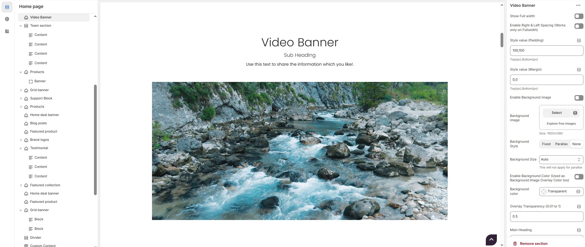

# Video Banner

The **Video Banner** section in Shopify allows you to add an engaging **video background or popup video** to enhance your store’s visual appeal. This feature is great for promotional content, brand storytelling, or product showcases.


* **Go to** Shopify Admin > **Online Store > Themes**.
* Click **Customize** on your active theme.
* In the Theme Editor, click **Add Section > Video Banner**.


<figure><figcaption></figcaption></figure>

### **Video Banner Section Settings & Customization Options:**

* **Show Full Width:** Expands the section across the entire screen width.
* **Enable Right & Left Spacing(Workd only on Fullwidth):** Adds spacing on both sides (Works only in Full Width mode).
* **Padding (Top, Bottom):** Adjust the inner spacing above and below the section. Top(px), Bottom(px).
* **Margin (Top, Bottom):** Adjust the outer spacing above and below the section. Top(px), Bottom(px).
* **Enable Background Image:** Allows adding a background image for the section.
* **Background Image:** Upload the image (Recommended size based on design requirements).
* **Background Style:** Choose background style **( Fixed, Parallax, or None )**.
* **Background Size:** Choose background size **( Auto, Cover, Contain, Repeat)**.
* **Enable Background Color:**&#x41;llows to enable the background color.
* **Background Color :** Customize the background color (Set Your Preferred Color).
* **Enable Overlay:** Adds an overlay effect to the background.
* **Overlay Transparency:** Adjust the transparency of the overlay (value between 0.01 and 1).
* **Main Heading:** Customize the Main heading.
* **Sub Heading:** Add a short text to the content.
* **Description:** Add text to share information about the section.
* **Link Text:** Customize the text for the clickable link.
* **Link URL:** Paste a URL or search for an internal link.

### **Section Color Settings**

* **Heading Color**: Customize the main heading color (Set Your Preferred Color).
* **Sub Heading Color**: Customize the sub-heading color (Set Your Preferred Color).
* **Description Color**: Customize the description text color (Set Your Preferred Color).
* **Button Background Color**: Customize the button background color (Set Your Preferred Color).
* **Button Text Color**: Customize the button text color (Set Your Preferred Color).
* **Button Hover Background Color**: Customize the hover background color of the button (Set Your Preferred Color).
* **Button Hover Text Color**: Customize the button text color on hover (Set Your Preferred Color).
* **Heading Position :** Choose heading position **( Center, Left, Right ).**

### **Video Banner - Content Settings**

* **Title**: Customize the video banner title.
* **Sub Title**:  Add a short text to the conten
* **Description**: Add text to share information about the section.
* **Link Text**: Customize the text for the clickable link.
* **Link URL**:  Paste a URL or search for an internal link.
* **Content Position**: Choose the content position **(Top left, Top center, Top bottom, Center left, Center, Center right, Bottom left, Bottom center, Bottom right).**
* **Text Alignment**: Choose text alignment **( Center, Left, Right ).**

### **Video Banner - Media Settings**

* **Layout Style**: Choose layout style **(Full width or Two column).**
* **Content Reverse**: Reverse the content order if required.
* **Poster Image**: Upload the image&#x20;
* **Show Image**: Enable/disable the display of the image.
* **Video Format**: Choose the video format **( Self hosted video, External video or popup).**
* **Video Icon:** Upload the icon.
* **Self-Hosted Video URL**: Add the video file URL (e.g., `https://storage.googleapis.com/coverr-main/mp4/Palm_Trees.mp4`).
* **Iframe Code (For External Video & Popup)**: Embed a video from YouTube, Vimeo, etc. (e.g., `https://www.youtube.com/embed/JJMPKgyCoSY`).
* **Video Height**: Adjust the video height.
* **Overlay Style**: Choose the overlay style **(With defalut overlay or with mask overlay ).**
* **Mask Image**: Upload the image (Recommended size based on design requirements).
* **Enable Box Shadow**: Adds a shadow effect to the video.
* **Collection Border Radius**: The border corners can be rounded using the collection border-radius property. (Leave empty for default border radius).

### **Video Banner Color Settings**

* **Heading Color**: Customize the heading color ( Set Your Preferred Color ).
* **Subheading Color**: Customize the subheading color ( Set Your Preferred Color ).
* **Description Color**: Customize the description text color ( Set Your Preferred Color ).
* **Button Background Color**: Customize the button background color ( Set Your Preferred Color ).
* **Button Text Color**: Customize the button text color ( Set Your Preferred Color ).
* **Button Hover Background Color**: Customize the button hover background color  ( Set Your Preferred Color ).
* **Button Hover Text Color**: Customize the button text color on hover  ( Set Your Preferred Color ).
* **Video Overlay Color**: Customize the video overlay color  ( Set Your Preferred Color ).
* **Video Overlay Transparency**: Adjust the transparency of the overlay (value between 0.01 and 1).

### **Icon Color Settings (For Popup Video Format)**

* **Icon Background Color**: Customize the background color of the play button ( Set Your Preferred Color ).
* **Icon Color**: Customize the color of the play icon ( Set Your Preferred Color ).
* **Icon Background Hover Color**: Customize the icon color for the play button on hover ( Set Your Preferred Color ).
* **Icon Hover Color**: Customize the icon color on hover ( Set Your Preferred Color ).

### **Advanced Customization**

* [**Custom Class:**](https://wdtsupport.gitbook.io/shopify-os/custom-class) The Shopify allows you to apply unique CSS styles to specific sections, blocks, or elements within your theme.
