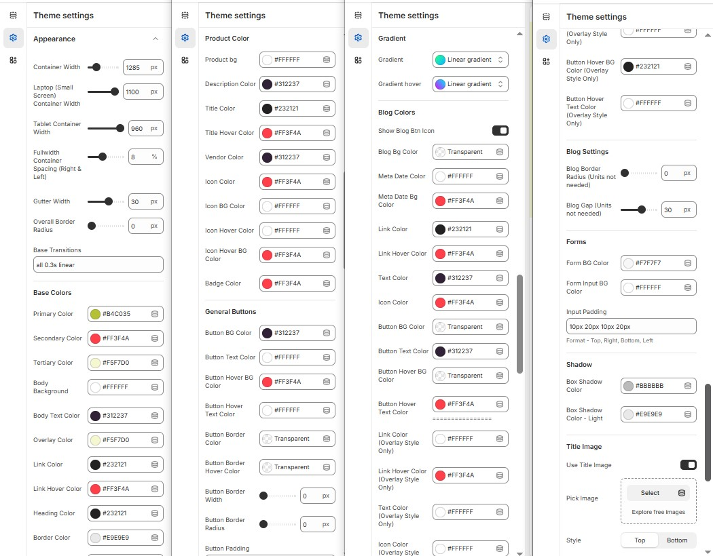

# Appearance

The **Appearance Settings** page allows users to customize the overall look and feel of the theme, including colors, layout, typography, and button styles. These settings help in achieving a visually appealing and consistent design for the store.


* **Log in** to your Shopify admin.
* Navigate to **Online Store > Themes**.
* Locate the theme you want to edit and click **Customize**.
* In the Theme Editor, go to **Theme Settings > Appearance**.


### **Appearance  Customization Options**

* **Container Width** : In the ContainerWidth Option, You can set the width to the container of the page in pixels for desktop, laptop, and tablet views.
* **Fullwidth Container Spacing (Right & Left)** : Adds spacing on both sides (Works only in Full Width mode).
* **Gutter Width** : Customize spacing between columns.
* **Overall Border Radius** : The border corners can be rounded using the theme border-radius property. (Leave empty for default border radius).
* **Base Transitions** : Customize animation speed for interactive elements.

### **Base Colors**

* **Primary, Secondary & Tertiary colors:** The color  commonly use to alter the base color of the theme (Set Your Preferred Color).
* **Body Background Color & Body Text Colors** : Customize body background color and text colors for readability (Set Your Preferred Color).
* **Overlay  Colors** : Customize overlays color (Set Your Preferred Color).
* **Link & Link hover Color :** Provides the color for the anchor tag (Set Your Preferred Color).
* **Heading Color:**  Provides the color for the Heading (Set Your Preferred Color).
* **Border Color :** Provides the border color of the theme (Set Your Preferred Color).
* **Error, Success, Info & Warning Colors** : Define alert colors for messages (Set Your Preferred Color).

### **Product Color**

* **Product Bg :** Add on Background to the product card (Set Your Preferred Color).
* **Description Color:**&#x61;nd body content of product (Set Your Preferred Color).
* **Title Color:** Add on the color to the heading content.
* **Title Hover Color :** Provides an hover color to the title (Set Your Preferred Color).
* **Vendor Color :** Provide color to the vendor tag of the product (Set Your Preferred Color).
* **Icon Color:** Provide color to the icon (Set Your Preferred Color).
* **Icon Bg Color:** Provide Background color to the icon (Set Your Preferred Color).
* **Icon Hover Color:**&#x50;rovide hover color to icon (Set Your Preferred Color).
* &#x20;**Icon Hover Bg Color :** Provide hover background Color for icon(Set Your Preferred Color).
* **Badge Color :** provides color to the badge of product (Badge : sale, new) (Set Your Preferred Color)..

### **General Button**&#x20;

* **Button BG Color:** Set a background color to the button (Set Your Preferred Color).
* **Button Text Color**: Set a text color to the button (Set Your Preferred Color).
* **Button Hover BG Color:** Set a background hover color to the button (Set Your Preferred Color).
* **Button Hover Text Colors** : Set a text hover color to the button (Set Your Preferred Color).
* **Button Border Color :** Used to set button border color(Set Your Preferred Color).
* **Button Border Hover Color** : Used to set button border hover color (Set Your Preferred Color).
* **Button Border Width :** Use to alter the width of the border.
* **Button Border Radius :** The button shape and size can be adjust using radius (for rounded 50%) .
* **Button Padding :** Use to add inner space to the button.

### **Gradient**&#x20;

* **Gradient :** Add gradient color to the button on selecting the dropdown and adjusting the range.
* **Gradient Hover:** Add gradient hover color to the button on selecting the dropdown and adjusting the range.

### **Blog Color**

* **Show Blog Btn Icon :** On enabling the option its allows to add an icon to the button.&#x20;
* **Blog Bg Color :** Use to add background color to the blog  (Set Your Preferred Color).
* **Meta Date color:** Its allows to add color to the blog date  (Set Your Preferred Color).
* **Meta Date Bg color :** Its allows to add background color to the blog date  (Set Your Preferred Color).
* **Link Color:** Allows to add color to anchor tag  (Set Your Preferred Color).
* **Link hover color :** Allows to add hover color to anchor tag  (Set Your Preferred Color).
* **Text color :** Allow to add color to the body text  (Set Your Preferred Color).
* **Icon Color :** Allow to add color to the blog icons  (Set Your Preferred Color).
* **Button Bg Color:** Set a background color to the button (Set Your Preferred Color).
* **Button Text Color :** Set a text color the button (Set Your Preferred Color).
* **Button Hover Bg Color:** Set a background  hover color to the button (Set Your Preferred Color)
* **Button Hover Text Color :** Set a text hover color to the button (Set Your Preferred Color).
* **Link Color ( Overlay Style Only ):**  Allows to add color to anchor tag  only for the overlay style (Set Your Preferred Color).
* **Link Hover Color( Overlay Style Only ):** Allows to add  hover color to anchor tag  only for the overlay style (Set Your Preferred Color).
* **Text color ( Overlay Style Only ):** Allow to add color to the body text in overlay style  (Set Your Preferred Color).
* **Icon Color ( Overlay Style Only ):** Allow to add color to the blog icons in overlay style  (Set Your Preferred Color).
* **Button Bg Color ( Overlay Style Only ):** Set a background color to the button in overlay style  (Set Your Preferred Color).
* **Button Text Color ( Overlay Style Only ):** Set a text color to the button in overlay style  (Set Your Preferred Color).
* **Button Hover Bg Color ( Overlay Style Only ):**  Set a background  hover color to the button in overlay style (Set Your Preferred Color).
* **Button Hover Text Color( Overlay Style Only ) :**  Set a text hover color to the button in overlay style (Set Your Preferred Color).

### **Blog Settings**

* **Blog Border Radius (Units not needed):** The button shape and size can be adjust using border radius (for rounded 50%).&#x20;
* **Blog Gap (Units not needed) :** Allows to set gap to the blo&#x67;**.**

### **Forms**

* **Form Bg Color:** Allows to set the background color to the form  (Set Your Preferred Color).
* **Form Input Bg Color:** Add background color to the input form  (Set Your Preferred Color).
* **Input Padding:** Use to add inner space to the input(**Format** - Top, Right, Bottom, Left).

### **Shadow**

* **Box Shadow Color:** Allow you to control how light or dark the shadow appears with color options  (Set Your Preferred Color).
* **Box Shadow Color - Light :** Allow you to control how light or dark the shadow appears with color options  (Set Your Preferred Color).

### **Title Image**

* **Enable Title Image**: Enable or disable the title image.
* **Pick Image:** Upload the image (Recommended size based on design requirements).
* **Style:** Choose the style **(Top or Bottom )**.

<figure><figcaption></figcaption></figure>
