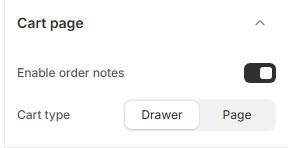

# Cart Page

The **Cart Page Settings** allow users to customize how the shopping cart functions and appears in the store.


* **Log in** to your Shopify admin.
* Navigate to **Online Store > Themes**.
* Find the theme you want to edit and click **Customize**.
* Go to **Theme Settings > Cart Page**.


### **Customization Options**

<figure><figcaption></figcaption></figure>

* **Enable Order Notes** : Allows customers to add special instructions or notes to their orders.
* **Cart type:** There are 2 types of cart options drawer and page cart.
* **Drawer Cart** : Displays a sliding cart sidebar when a product is added.
* **Page Cart** : Redirects customers to a separate cart page.
