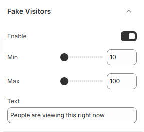

# Fake Visitors

The **Fake Visitors** feature creates a sense of urgency by displaying the number of people currently viewing a product. This can help boost conversions by leveraging social proof.


* **Log in** to your Shopify admin.
* Navigate to **Online Store > Themes**.
* Click **Customize** on the theme you want to edit.
* Go to **Theme Settings > Fake Visitors** .


### **Customization Options:**

<figure><figcaption></figcaption></figure>

* **Enable**: Toggle this option to display visitor count.
* **Min**: Define the lowest number of visitors shown (e.g., 10)**(Minimum Visitors).**
* **Max**: Define the highest number of visitors displayed (e.g., 100)**(Maximum Visitors).**
* **Text**: Modify the default message (e.g., "People are viewing this right now") to fit your store's tone.

<figure><figcaption></figcaption></figure>
