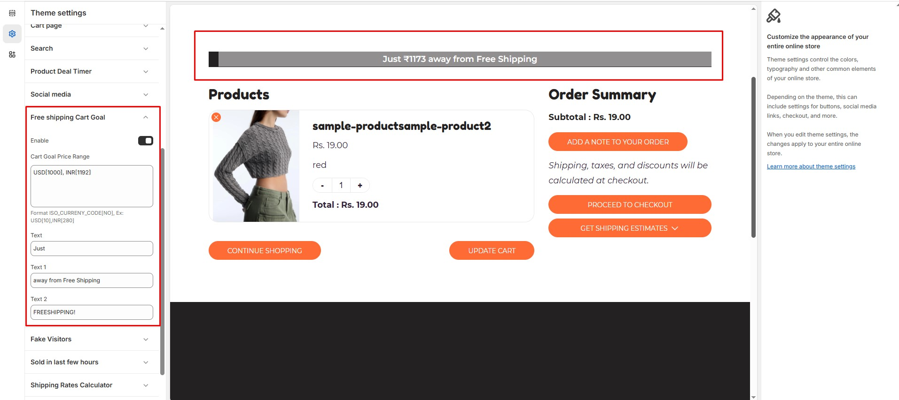

# Free shipping Cart Goal

The **Free Shipping Cart Goal** feature helps encourage customers to increase their cart value to qualify for free shipping.


* **Log in** to your Shopify admin.
* Navigate to **Online Store > Themes**.
* Click **Customize** on the theme you want to edit.
* Go to **Theme Settings > Free Shipping Cart Goal**.


### **Customization Options**

<figure><figcaption></figcaption></figure>

* **Enable**: Activate the free shipping incentive for customers.
* **Cart Goal Price Range** : Customize the minimum cart value required for free shipping. ( Format: ISO\_CURRENCY\_CODE\[Amount] - Example: USD\[10], INR\[280] )
* **Text**: Set the text displayed to customers (**Custom Free Shipping Message)(Text, Text 1 and Text 2)**
* &#x20;**Example:** "Just $50 away from Free Shipping!"
* **Text:** Just.
* **Text 1:** $50 away from Free Shipping.
* **Text 2:** FREE SHIPPING!.

<figure><figcaption></figcaption></figure>
