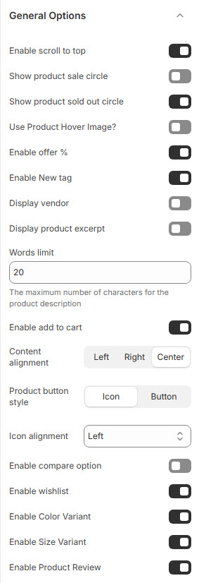

# General Options

The **General Options** settings allow users to configure essential display features for products, improving the shopping experience with enhanced visual elements and functionalities.


* **Log in** to your Shopify admin.
* Navigate to **Online Store > Themes**.
* Find the theme you want to edit and click **Customize**.
* Go to **Theme Settings > General Options**.


### **Customization Options**

<figure><figcaption></figcaption></figure>

* **Enable Scroll to Top** : Adds a button to quickly return to the top of the page.
* **Show Product Sale Circle** : Displays a circular badge highlighting discounted products.
* **Show Product Sold Out Circle** : Marks out-of-stock products with a "Sold Out" badge.
* **Use Product Hover Image?** : Displays an alternate product image when hovering over a product.
* **Enable Offer %** : Shows the percentage of discount applied to a product.
* **Enable New Tag** : Adds a "New" label to recently added products.
* **Display Vendor** : Shows the vendor or brand name under the product title.
* **Display Product Excerpt** : Enables a short product description.
  * **Words Limit** : Customize a maximum of  words for the product description (Eg., 20).
* **Enable Add to Cart** : Allows users to add products to the cart directly from the listing page.
* **Content Alignment** : Choose product content alignment **(** **Left, Right, or Center )**.
* **Product Button Style** : Choose product button style **(Icon or Button).**
  * **Icon** : Shows only an icon for add-to-cart actions.
  * **Button** : Displays a full "Add to Cart" button.
* **Icon Alignment** : Choose the position of icons alignment **Left, Right, Center or Bottom)**.
* **Enable Compare Option** : Allows customers to compare multiple products.
* **Enable Wishlist** : Adds a wishlist button to save favorite products.
* **Enable Color Variant** : Displays available color variants for products.
* **Enable Size Variant** : Displays available size options.
* **Enable Product Review** : Activates a review section for customers to leave feedback.
