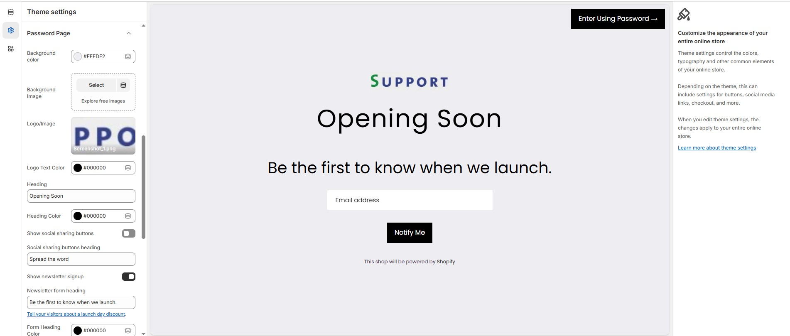

# Password Page

The **Password Page** allows you to create a coming soon or restricted access page for your store. You can customize its appearance and content to match your brand identity while engaging visitors before launch.


* **Log in** to your Shopify admin.
* Navigate to **Online Store > Themes**.
* Click **Customize** on the theme you want to edit.
* Go to **Theme Settings > Password Page**


### **Customization Options:**

* **Background Color**: Customize the background color (Set Your Preferred Color).
* **Background Image**: Upload a custom background image.
* **Logo/Image**: Upload a brand logo or image.
* **Logo Text Color**: Customize the Logo text color (Set Your Preferred Color).
* **Heading**: Customize the heading (**"**&#x45;&#x67;**.,** Opening Soo&#x6E;**"**).
* **Heading Color**: Customize the heading color (Set Your Preferred Color).
* **Social Sharing Buttons**: Allow visitors to share your store.
* **Social Sharing Heading**: Customize the social sharing heading (**"**&#x45;&#x67;**.,** Spread the wor&#x64;**"**).
* **Enable Newsletter Signup**: Allow visitors to subscribe before launch.
* **Newsletter Form Heading**: Customize the text (**"**&#x45;g., Be the first to know when we launch.**"**).
* **Form Heading Color**: Customize the form heading color (Set Your Preferred Color).
* **Input Background Color**: Customize the input field background  (Set Your Preferred Color).
* **Button Background Color**: Customize the button background color (Set Your Preferred Color).
* **Button Text Color**: Customize the  button text color (Set Your Preferred Color).
* **Button Hover Background Color**: Customize the  button hover background color (Set Your Preferred Color).
* **Button Hover Text Color**: Customize the  button hover text color (Set Your Preferred Color).
* **Placeholder Text Color**: Customize the placeholder text color (Set Your Preferred Color).
* **Newsletter Placeholder Text**: Customize the placeholder text (**"**&#x45;g., Email addres&#x73;**"**).
* **Newsletter Button Text**: Customize button text (**"**&#x45;g., Notify m&#x65;**"**).
* **Social Title Color**: Customize the social title color (Set Your Preferred Color).
* **Social Icon Color**: Customize the social icon color (Set Your Preferred Color).
* **Social Icon Hover Color**:  Customize the social icon hover color (Set Your Preferred Color).

<figure><figcaption></figcaption></figure>

