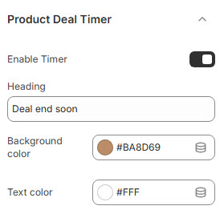
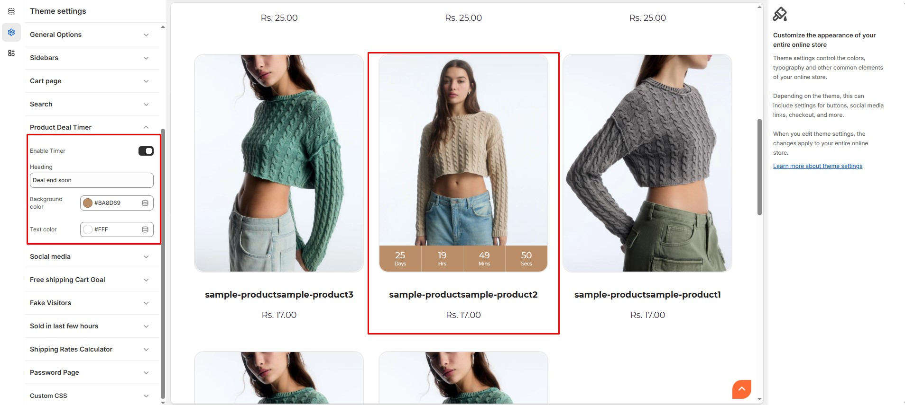

# Product Deal Timer

The **Product Deal Timer Settings** allow you to enable and customize a countdown timer for time-sensitive deals and promotions.


* **Log in** to your Shopify admin.
* Navigate to **Online Store > Themes**.
* Locate your theme and click **Customize**.
* Go to **Theme Settings > Product Deal Timer**.


### **Customization Options**

<figure><figcaption></figcaption></figure>

* **Enable Timer** : Activate or deactivate the deal countdown timer.
* **Heading** : Customize the timer heading text (Eg., "Deal end soon").
* **Background Color** : Customize the timer’s background color (Set Your Preferred Color).
* **Text Color** : Customize the text color for the countdown (Set Your Preferred Color).

<figure><figcaption></figcaption></figure>
