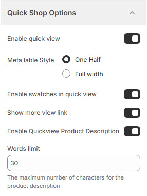

# Quick Shop Options

The **Quick Shop Options** settings allow users to configure the Quick View feature, making it easier for customers to preview product details without leaving the current page.


* **Log in** to your Shopify admin.
* Navigate to **Online Store > Themes**.
* Find the theme you want to edit and click **Customize**.
* Go to **Theme Settings > Quick Shop Options**.


### **Customization Options**

<figure><figcaption></figcaption></figure>

* **Enable Quick View** :  Check this option to allow customers to preview product details in a pop-up without navigating to the product page.
* **Meta label style :** Choose the meta label style **( One half or Full width ).**
  * **One Half** : Displays product meta information in a compact layout.
  * **Full Width** : Expands the product meta details to the full width of the pop-up.
* **Enable Swatches in Quick View** : Display product variant color or size swatches inside the Quick View pop-up.
* **Show More View Link** : Provides an option to view the full product details page from the Quick View window.
* **Enable Quick View Product Description** : Show a short product description inside the Quick View pop-up.
* **Words Limit** : Set a limit for the product description text (eg., 30).
