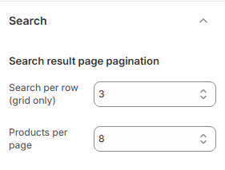

# Search

The **Search Settings** allow users to customize how search results are displayed on the store.


* **Log in** to your Shopify admin.
* Navigate to **Online Store > Themes**.
* Find the theme you want to edit and click **Customize**.
* Go to **Theme Settings > Search**.


### **Customization Options**

<figure><figcaption></figcaption></figure>

**Search Result Page Pagination**

* **Search Per Row (Grid Only)** : Defines the number of products displayed per row in the grid layout.
* **Products Per Page** : Sets the total number of products shown per search result page.
