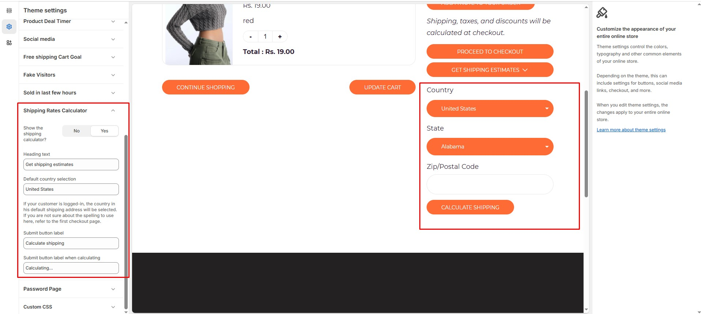

# Shipping Rates Calculator

Depending on your store's Shopify subscription plan and the order that you're shipping, you might be eligible for discounted shipping rates from [Shopify Shipping carriers](https://help.shopify.com/en/manual/fulfillment/shopify-shipping/shipping-carriers).


* **Log in** to your Shopify admin.
* Navigate to **Online Store > Themes**.
* Click **Customize** on the theme you want to edit.
* Go to **Theme Settings > Shipping Rates Calculator**


* **Show the Shipping Calculator?:** The option allow to enable the shipping calculator in cart.
* **Heading Text:** Adds heading to the shipping calculator.
* **Default Country Selection:** The option allow to enter the default country name in shipping calculator
* **Submit Button Label:** This option allows you to enter a custom button label for the shipping calculator.
* **Submit Button Label When Calculating:** This option allows you to enter a custom button label for the shipping calculator on calculating process.


The process is based on country which shipping charge. It works on calculating the zip code enter by the cart


<figure><figcaption></figcaption></figure>
