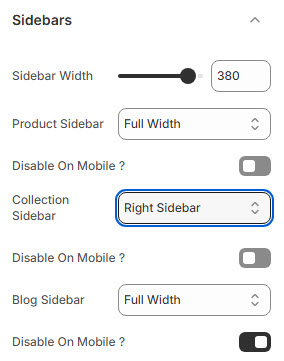

# Sidebars

The **Sidebars Settings** allow users to configure the layout and visibility of sidebars across different sections of the store, ensuring a well-structured browsing experience.


* **Log in** to your Shopify admin.
* Navigate to **Online Store > Themes**.
* Find the theme you want to edit and click **Customize**.
* Go to **Theme Settings > Sidebars**.


### **Customization Options**

<figure><figcaption></figcaption></figure>

* **Sidebar Width**: Customize the width of sidebars .
* **Product Sidebar**: Choose the placement of the sidebar:&#x20;
  * **Left Sidebar** : Displays the product sidebar on the left.
  * **Right Sidebar** : Displays the collection product on the right.
  * **Full Width :** Displays the collection product on the full width.
* **Disable on Mobile?** : Hide the product sidebar on mobile devices for a cleaner layout.
* **Collection Sidebar**: Choose the placement of the sidebar:
  * **Left Sidebar** : Displays the collection sidebar on the left.
  * **Right Sidebar** : Displays the collection sidebar on the right.
  * **Full Width :** Displays the collection sidebar on the full width.
* **Disable on Mobile?** : Hide the Collection sidebar on mobile devices for a cleaner layout.
* **Blog Sidebar** : Choose the placement of the sidebar:
  * **Left Sidebar** : Displays the Blog sidebar on the left.
  * **Right Sidebar** : Displays the Blog sidebar on the right.
  * **Full Width :** Displays the Blog sidebar on the full width.
* **Disable on Mobile?** : Hide the blog sidebar on mobile devices for a cleaner layout.

#### **Sidebar Color**

* **Title Bg :** Customize the title background color (Set Your Preferred Color).
* **Title Color :** Customize the title color (Set Your Preferred Color).
* **Title Border :** Customize the title border color (Set Your Preferred Color).&#x20;
