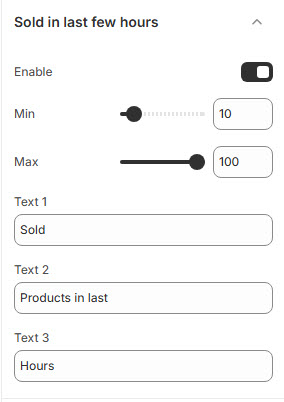

# Sold in Last Few Hours

The **Sold in Last Few Hours** feature helps create urgency by displaying the number of products sold recently. This encourages potential buyers to make faster purchasing decisions.


* **Log in** to your Shopify admin.
* Navigate to **Online Store > Themes**.
* Click **Customize** on the theme you want to edit.
* Go to **Theme Settings > Sold in Last Few Hours**


### **Customization Options:**

<figure><figcaption></figcaption></figure>

* **Enable**: Toggle this option to activate the feature.
* **Min**: Define the lowest number of products sold (e.g., 10) **(Set Minimum Sold Count)**.
* **Max**: Define the highest number of products sold (e.g., 100)**(Set Maximum Sold Count)**.
* **Text 1**: Define the prefix (e.g., "Sold").
* **Text 2**: Define the middle text (e.g., "Products in last").
* **Text 3**: Define the time reference (e.g., "Hours").

This feature enhances the **fear of missing out (FOMO)** and builds trust by showcasing product demand.

<figure><figcaption></figcaption></figure>
